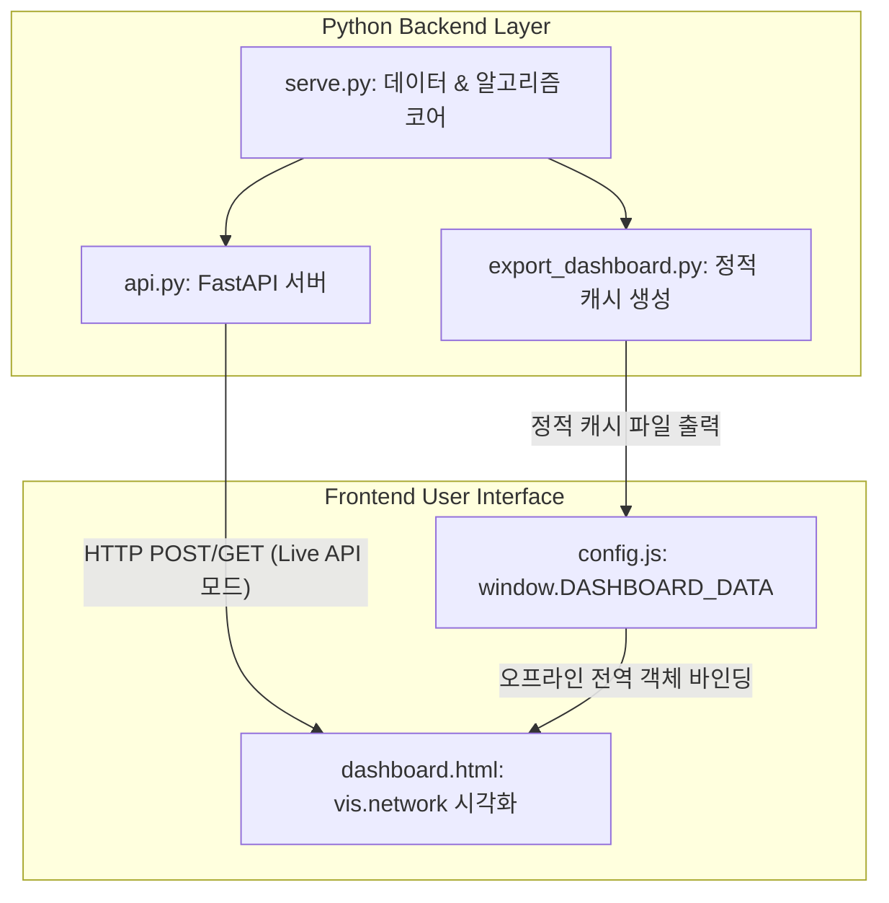

# 7-Eleven NPD Dashboard Connection Guide

이 문서는 이기종 그래프 신경망(HIN) 기반 신제품 예측 프레임워크의 대시보드 코어 코드인 [serve.py](file:///C:/Users/송정현/Documents/Projects/박재홍교수님세미나/Projects/20기/7eleven_npd_framework/src/eval/serve.py)와 프론트엔드 UI인 [dashboard.html](file:///C:/Users/송정현/Documents/Projects/박재홍교수님세미나/Projects/20기/7eleven_npd_framework/Dashboard/dashboard.html)이 어떻게 상호작용하는지, 그리고 각 파일에 구현된 기능들을 설명합니다.

---

## 1. 아키텍처 및 연결 방식 (Connection Architecture)

대시보드는 사용자 환경에 따라 **온라인 라이브 API 모드**와 **오프라인 정적 캐시 모드**의 두 가지 형태로 동작하며, 두 모드 모두 [serve.py](file:///C:/Users/송정현/Documents/Projects/박재홍교수님세미나/Projects/20기/7eleven_npd_framework/src/eval/serve.py)를 핵심 데이터/알고리즘의 Single Source of Truth로 공유합니다.

### 1) 온라인 라이브 API 모드 (Live API Server Mode)
* **매개체**: [api.py](file:///C:/Users/송정현/Documents/Projects/박재홍교수님세미나/Projects/20기/7eleven_npd_framework/src/eval/api.py) (FastAPI 웹 서버)
* **동작 원리**:
  1. 로컬에서 uvicorn 서버를 실행합니다 (`python -m uvicorn src.eval.api:app --port 8000`).
  2. [dashboard.html](file:///C:/Users/송정현/Documents/Projects/박재홍교수님세미나/Projects/20기/7eleven_npd_framework/Dashboard/dashboard.html)이 브라우저에서 실행되면 `http://localhost:8000` 백엔드를 대상으로 비동기 HTTP 요청을 보냅니다.
  3. [api.py](file:///C:/Users/송정현/Documents/Projects/박재홍교수님세미나/Projects/20기/7eleven_npd_framework/src/eval/api.py)는 들어오는 API 요청을 라우팅하여 [serve.py](file:///C:/Users/송정현/Documents/Projects/박재홍교수님세미나/Projects/20기/7eleven_npd_framework/src/eval/serve.py)의 분석/추론 함수들을 호출하고, 그 결과를 JSON 형식으로 응답합니다.
* **주요 엔드포인트**:
  * `POST /infer`: 입력된 검색어를 바탕으로 연관 네트워크 속성을 추론.
  * `POST /network`: 선택된 속성(최대 3개)의 1-hop 인접 네트워크 및 병합 그래프 생성.
  * `POST /combo`: 신규 조합의 서브네트워크 전개 데이터 획득 ([combo_serve.py](file:///C:/Users/송정현/Documents/Projects/박재홍교수님세미나/Projects/20기/7eleven_npd_framework/src/eval/combo_serve.py) 연동).

### 2) 오프라인 정적 캐시 모드 (Offline Static Cache Mode)
* **매개체**: [export_dashboard.py](file:///C:/Users/송정현/Documents/Projects/박재홍교수님세미나/Projects/20기/7eleven_npd_framework/scripts/export_dashboard.py) & [config.js](file:///C:/Users/송정현/Documents/Projects/박재홍교수님세미나/Projects/20기/7eleven_npd_framework/Dashboard/config.js)
* **동작 원리**:
  1. 사전 준비 단계에서 `python -m scripts.export_dashboard`를 실행합니다.
  2. 이 스크립트는 [serve.py](file:///C:/Users/송정현/Documents/Projects/박재홍교수님세미나/Projects/20기/7eleven_npd_framework/src/eval/serve.py)를 실행하여 모든 기지 트렌드에 대응하는 속성과 1-hop 네트워크 정보를 사전 연산(Pre-calculate)합니다.
  3. 연산 결과는 [config.js](file:///C:/Users/송정현/Documents/Projects/박재홍교수님세미나/Projects/20기/7eleven_npd_framework/Dashboard/config.js) 파일의 전역 변수인 `window.DASHBOARD_DATA`에 JSON 객체 형태로 직렬화되어 저장됩니다.
  4. [dashboard.html](file:///C:/Users/송정현/Documents/Projects/박재홍교수님세미나/Projects/20기/7eleven_npd_framework/Dashboard/dashboard.html)은 로드 시 `DASHBOARD_DATA`가 존재하면 **오프라인 모드**로 판정합니다. 서버 없이 로컬 환경(`file://` 프로토콜)에서도 사전에 연산된 데이터베이스를 바탕으로 네트워크 렌더링, 병합, 설명 생성(`localNetwork`, `localExplain`) 작업을 수행합니다.

---

## 2. [serve.py](file:///C:/Users/송정현/Documents/Projects/박재홍교수님세미나/Projects/20기/7eleven_npd_framework/src/eval/serve.py) 구현 기능

학습 완료된 최고 성능(Best) 모델의 오프라인 서빙과 RAG(검색 증강 생성) 로직을 통합 관리하는 백엔드 핵심 라이브러리입니다. (PyTorch나 GPU 없이 고속 오프라인 서빙이 가능하도록 설계됨)

### 1) 데이터 캐싱 및 전처리 (`_data()`)
* **메모리 캐싱**: `@lru_cache(maxsize=1)`를 사용하여 다차원 가중치 엣지 데이터(`weighted_product_keyword_edges.parquet`), POS 판매량 피처, 트렌드 속성 매핑 정보 등을 1회 로드하여 메모리에 적재 및 캐싱합니다.
* **이기종 네트워크 인접 리스트 빌드**: 키워드(Keyword), 상품(Product), IP 노드 간의 학습된 어텐션(Attention) 및 릴레이션 게이트(Relation Gate) 가중치를 기반으로 통합 단방향/양방향 인접 그래프(`hadj`)를 구성합니다.

### 2) 검색어 기반 속성 추론 (`infer_attrs`)
* **기지 트렌드 조회**: `trend_keywords.parquet`에 사전 등록된 트렌드 키워드인 경우 캐시 데이터에서 연관 속성을 즉시 반환합니다.
* **미지 트렌드 확장 (LLM RAG)**: 데이터에 존재하지 않는 임의의 검색어가 입력되면, 로컬 Ollama의 Gemma 모델(`gemma4:12b`)을 사용하여 식품 속성(맛, 식감, 컨셉 등)으로 확장한 뒤 기존 그래프 네트워크 노드명과 유사도 매칭(Substring/Exact match)을 진행하여 네트워크의 시작점을 확보합니다.

### 3) K-P-K (Keyword-Product-Keyword) 추천 알고리즘
* **`recommend_keywords`**: 시드 속성을 거쳐 도달할 수 있는 주변 시너지 속성을 탐색합니다. 어텐션 편향을 상쇄하기 위한 빈도 보정(Degree correction) 및 특정 카테고리(대분류) 한정 필터링을 지원합니다.
* **`recommend_bundle`**: 시드 키워드와 가장 일관되게 연결된 조밀한 속성 조합(Coherent Bundle)을 탐색하며 점수가 일정 한계 이하로 내려가면 동적으로 정지합니다.
* **`recommend_paths`**: 의외의 시너지(예: 마라 ↔ 라면 ↔ 얼큰)를 발굴하기 위해 특이성(Lift) 기반 빔 서치(Beam Search) 워크를 수행하여 추천 경로를 도출합니다.

### 4) 신제품 제안 카드 생성 (`recommend_proposals`)
* K-P-K 추천으로 생성된 후보 조합들을 바탕으로 MD용 신제품 기획 카드(k개)를 작성합니다.
* **LLM 상품명 생성**: Gemma 모델의 배치 생성 기능(`gemma_names_batch`)을 호출하여 추천 속성들이 혼합된 매력적인 신제품 기획명(예: `도파민직화불도시락`)을 생성합니다.
* **유사 성공 제품 매칭**: 제안된 속성 조합과 가장 많이 겹치는 기존의 실체 성공 상품 리스트를 `similar_success_products` 함수로 추출해 기획 카드의 타당성을 제공합니다.

### 5) 부진 상품 진단 (`diagnose`)
* 특정 부진 상품을 입력받아 모델이 예측한 핵심 기여도가 낮은(어텐션이 취약한) 속성을 분석해 냅니다.
* Gemma RAG 프롬프트를 이용해 부진의 원인이 된 회피 속성 및 리뉴얼 처방전(새로운 트렌드 속성 결합 등)을 자동 생성합니다.

---

## 3. [dashboard.html](file:///C:/Users/송정현/Documents/Projects/박재홍교수님세미나/Projects/20기/7eleven_npd_framework/Dashboard/dashboard.html) 구현 기능

MD가 기획 과정에서 다양한 트렌드 검색어를 입력하고 AI가 도출한 관계망을 직관적으로 조작할 수 있게 돕는 반응형 SPA(Single Page Application) 웹 화면입니다.

### 1) 트렌드 입력 및 속성 제어 패널 (좌측 영역)
* **다중 검색 블록**: 여러 개의 트렌드 입력칸을 구성해 각각 독립된 탭으로 네트워크를 비교할 수 있습니다.
* **동적 칩 필터**: 입력어 추론 버튼 클릭 시 하단에 노출되는 속성 칩들 중 핵심 시작점(최대 3개)을 직접 선택/제거할 수 있습니다.

### 2) vis.network 기반의 대화형 그래프 렌더링 (우측 영역)
* **노드 시각화**: 속성 키워드(초록), 상품(빨강), IP(주황) 노드를 직관적인 색상과 스케일(공유도/중요도에 따른 크기 변화)로 표시합니다.
* **엣지 가중치 표현**: 학습된 모델의 최종 가중치가 강할수록 노드 사이의 연결선을 굵고 진하게 렌더링합니다.
* **1-Hop 접기/펼치기**: 백본 노드를 더블클릭하면 1-hop 가지 노드들을 접고 펼칠 수 있어 대규모 그래프의 정보 과부하를 막아줍니다.
* **전체화면 모드**: Canvas 영역을 전체 화면 크기로 확장시킵니다.

### 3) 탐색 경로 추적 및 브리핑 패널
* **경로 추적기 (Path Tracker)**: 특정 노드를 클릭 시 해당 노드를 중심으로 좌우 가중치가 가장 높은 연결선만을 추적하여 그리디 경로(Greedy Path) 체인을 동적으로 띄워 줍니다.
* **브리핑 패널 (우측 드로어)**: 클릭한 노드의 세부 마스터 데이터를 시각화합니다.
  * **상품 노드**: 예측 성공확률(%), 활성화된 행사/프로모션 태그, 인스타그램 월간 언급 횟수, 연관 IP 등을 확인 가능.
  * **속성/IP 노드**: 연결 강도가 높은 주변 노드들의 랭킹과 연결 수준(강함/보통/약함) 제공.

### 4) 오프라인 복원력 기능 (Javascript Redundancy)
* 라이브 uvicorn 백엔드가 작동하지 않는 환경이라도 미리 빌드된 `config.js`가 있다면, `localNetwork` 함수를 통해 속성별 네트워크의 교집합 합집합 연산을 클라이언트 측 브라우저에서 실시간 연산하여 매끄럽게 렌더링해 줍니다.
