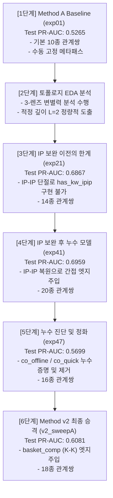

# 📝 7-Eleven NPD AI 프레임워크 모델 진화 및 성능 변화 종합 기술 보고서

본 보고서는 7-Eleven NPD(신제품 예측) AI 프레임워크의 R&D 개발 흐름에 따른 모델 구조 변화(단계별 관계쌍 명세 및 비즈니스적/모델링적 의미 포함) 및 성능 변화를 논리적 진화 단계에 맞춰 기술합니다.

---

## 💾 0. HIN 그래프 데이터셋 규격 및 스키마 (Dataset Specifications)

실험(exp01 ~ exp47, v2)에 공통 사용된 이기종 그래프(HIN) 데이터셋의 노드 및 엣지별 상세 물리 규격과 스키마 명세입니다.

### A. 노드 데이터 규격 (총 8,788개 노드)

| 노드 타입 (물리 파일) | 노드 수 | 주요 스키마 (컬럼) | 비즈니스적 의미 및 역할 |
|---|---|---|---|
| **제품 (Product)** ([product_nodes.parquet](file:///C:/Users/송정현/Documents/Projects/박재홍교수님세미나/Projects/20기/7eleven_npd_framework/data/processed/hin/product_nodes.parquet)) | 5,161개 | `ITEM_CD` (ID), `ITEM_NM` (상품명), `편의점명`, `성공여부` (Target), `첫_등장일`, `insta_mention_30d` (소셜 노출량), `키워드_final`, `promo_*` (18종 프로모션 여부 원핫) | 분석 및 기획 대상이 되는 편의점 3사 NPD 상품 (세븐일레븐 2,996 / CU 1,162 / GS25 1,003). 초기 피처로 콘텐츠 집계 표현 및 프로모션/인스타 반응 결합 |
| **키워드 (Keyword)** ([keyword_nodes.parquet](file:///C:/Users/송정현/Documents/Projects/박재홍교수님세미나/Projects/20기/7eleven_npd_framework/data/processed/hin/keyword_nodes.parquet)) | 3,345개 | `keyword` (키워드명), `is_trend_keyword` (트렌드 미디어 여부), `추출_속성` (7대 속성 카테고리 태그) | 상품 콘텐츠 분석의 최소 단위. LLM을 통해 정제된 맛/식감/TPO 등의 속성 키워드 및 knewnew 트렌드 선행 키워드 포함 |
| **IP/브랜드 (IP)** ([ip_nodes.parquet](file:///C:/Users/송정현/Documents/Projects/박재홍교수님세미나/Projects/20기/7eleven_npd_framework/data/processed/hin/ip_nodes.parquet)) | 282개 | `ip_name` (IP명), `키워드_final` (관련 키워드) | 캐릭터(예: 브롤스타즈, 캐치티니핑), 유명인(예: 백종원, 하정우), 제조사 브랜드 등 콜라보 기획에 사용되는 지식재산권 요소 |

### B. 엣지 데이터 규격 (총 46,600개 엣지)

| 관계 타입 (물리 파일) | 엣지 수 | 소스 노드 ➡️ 대상 노드 | 데이터 소스 및 역할 |
|---|---|---|---|
| **제품 ↔ 키워드** ([product_keyword_edges.parquet](file:///C:/Users/송정현/Documents/Projects/박재홍교수님세미나/Projects/20기/7eleven_npd_framework/data/processed/hin/product_keyword_edges.parquet)) | 41,335행 | Product ➡️ Keyword | 상품 마스터 정보(`B4_ITEM_DV_INFO`) 및 상품명에서 LLM이 추출한 제품 고유의 기획 속성 매핑 |
| **IP ↔ 키워드** ([ip_keyword_edges.parquet](file:///C:/Users/송정현/Documents/Projects/박재홍교수님세미나/Projects/20기/7eleven_npd_framework/data/processed/hin/ip_keyword_edges.parquet)) | 1,671행 | IP ➡️ Keyword | 콜라보 IP가 고유하게 지니는 이미지 및 속성 매핑 (예: 캐릭터의 대표 키워드) |
| **트렌드키워드 ↔ 속성키워드** ([trend_keyword_edges.parquet](file:///C:/Users/송정현/Documents/Projects/박재홍교수님세미나/Projects/20기/7eleven_npd_framework/data/processed/hin/trend_keyword_edges.parquet)) | 2,303행 | Keyword ➡️ Keyword | knewnew 등 트렌드 채널에서 추출한 선행 트렌드 키워드와 내부 속성 키워드 간의 연관 관계 정보 |
| **제품 ↔ IP** ([product_ip_edges.parquet](file:///C:/Users/송정현/Documents/Projects/박재홍교수님세미나/Projects/20기/7eleven_npd_framework/data/processed/hin/product_ip_edges.parquet)) | 1,291행 | Product ➡️ IP | 해당 상품 기획 시 콜라보하거나 차용한 IP/브랜드 매핑 관계 |

---

## 🗺️ 1. 6단계 진화 흐름 개요 (Roadmap)

---

## 🛠️ [1단계] Method A 베이스라인 — `exp01_baseline`
* **설정 파일**: [exp01_baseline.yaml](file:///C:/Users/송정현/Documents/Projects/박재홍교수님세미나/Projects/20기/7eleven_npd_framework/experiments/configs/exp01_baseline.yaml)
* **성능**: **Test PR-AUC 0.5265** / Test ROC-AUC 0.7725 / Test F1 0.5333 (Threshold 0.3889)

### A. 엣지 관계쌍 명세 (기본 10종) 및 설계/추출 로직
1. **`(product, has_kw, keyword)` & 역방향 `(keyword, rev_has_kw, product)`**
   * **비즈니스 의미**: 상품이 자체적으로 가지는 제품 기획 속성(원재료, 맛, 식감, TPO 등)과의 직접 연결입니다. 신상품 기획 시 반영되는 1차적이고 핵심적인 제품 기획 정보입니다.
   * **설계 및 추출 로직**: 상품 마스터 정보(`B4_ITEM_DV_INFO`)의 `ITEM_NM`(상품명)을 파싱한 후, LLM(Claude/GPT) 프롬프트 엔지니어링을 거쳐 '형태', '맛', '식감' 등 7대 기획 속성 범주에 속하는 대표 키워드 노드들과 상품 노드를 1대1 매핑하여 엣지를 생성합니다.
2. **`(ip, has_kw, keyword)` & 역방향 `(keyword, rev_has_kw, ip)`**
   * **비즈니스 의미**: 캐릭터, 인플루언서, 브랜드 등의 콜라보 IP가 자체적으로 내포하고 있는 고유 이미지와 연관 속성을 결합합니다. (예: `미미미누` IP ➡️ `수능`, `입시`, `공부` 등)
   * **설계 및 추출 로직**: IP 노드의 마스터 프로필 텍스트 및 나무위키 사전 텍스트를 LLM에 입력하여 해당 IP의 아이덴티티를 대변하는 핵심 키워드 리스트를 정의하고, 이들을 그래프 상에서 직접 연결합니다.
3. **`(keyword, trend_to, keyword)` & 역방향 `(keyword, rev_trend_to, keyword)`**
   * **비즈니스 의미**: 소셜 트렌드 미디어나 선행 분석 채널에서 추출한 선행 트렌드 키워드와 내부 속성 키워드를 가교하여 트렌드 가치를 모델에 주입합니다.
   * **설계 및 추출 로직**: knewnew 등의 소셜 버즈 데이터 상에서 동시 노출 빈도(Co-occurrence)를 연산하여, 특정 스코어 임계치를 상회하는 트렌드 키워드와 일반 속성 키워드 쌍을 식별해 엣지로 빌딩합니다.
4. **`(product, has_ip, ip)` & 역방향 `(ip, rev_has_ip, product)`**
   * **비즈니스 의미**: 상품이 기획 시점부터 채택하여 적용한 콜라보레이션 브랜드 및 지식재산권(IP) 관계입니다. (예: `하정우 와인` ➡️ `하정우` IP 노드)
   * **설계 및 추출 로직**: 상품명 내의 텍스트 매칭 및 기획 설명서를 파싱하여, IP 사전 목록에 등록된 고유 IP 브랜드명이 상품 텍스트에 포함되어 있거나 지정되어 있을 때 상품 노드와 IP 노드를 1대1로 직접 매핑해 엣지를 형성합니다.
5. **`(ip, has_ip, ip)` & 역방향 `(ip, rev_has_ip, ip)`**
   * **비즈니스 의미**: IP 노드들 상호 간의 계열사, 제조 브랜드 또는 파트너십 협업 관계입니다.
   * **설계 및 추출 로직**: IP 마스터 데이터에서 상하위 관계(예: `산리오` ➡️ `마이멜로디`)나 콜라보 파트너십을 사전에 관계 정의하여 생성합니다. (단, 1단계에서는 데이터 누락으로 인해 실제 연결이 생성되지 못함)

### B. 아키텍처 및 인접행렬 연산
* **수동 메타패스 제약**: 추천 및 임베딩 순회 시 사람이 임의로 정의한 단일 메타패스 `[keyword → product → keyword]` 경로 위에서만 메시지가 제한적으로 이동할 수 있도록 고정하는 인접행렬 차단 방식을 사용함.
* **연산 구조**: 2개 층(Layer)의 GNN 신경망을 스택하여 $H^{(2)}$를 최종 표상으로 삼음.
  * $H^{(1)} = \text{GNN}_1(H^{(0)}, A_r)$
  * $H^{(2)} = \text{GNN}_2(H^{(1)}, A_r)$
* **한계**: 관계별 가중치 $\alpha_r$이 $1/8 \approx 0.125$ 부근으로 평탄해지는 미분화 현상이 발생하여 관계 간의 변별력이 증발하고, 노드 임베딩이 평균화되는 오버스무딩(Over-smoothing) 현상이 일어남.

---

## 📊 [2단계] 네트워크 깊이(L) 결정을 위한 토폴로지 EDA 분석
* **분석 노트북**: [05_metapath_topology_eda.ipynb](file:///C:/Users/송정현/Documents/Projects/박재홍교수님세미나/Projects/20기/7eleven_npd_framework/eda/notebooks/05_metapath_topology_eda.ipynb)
* **설계 가이드**: [methodology_metapath_search.md](file:///C:/Users/송정현/Documents/Projects/박재홍교수님세미나/Projects/20기/7eleven_npd_framework/docs/methodology_metapath_search.md)

수학적 토폴로지 분석을 수행했습니다. 이를 위해 노드 7,431개(P:5,033 / K:2,063 / I:335)를 포함하는 전역 이기종 인접행렬 $A_{full}$을 구성하고, CSR 희소 행렬 연산을 활용한 **[홉별 도달성 ➡️ 경로 폭발성 ➡️ 성공 동질성(Lift) 검정]**의 3단계 프로세스를 거쳐 **모델 전파 깊이를 L=2로 최종 결정**했습니다.

### 📌 홉별 도달성 및 연산 오버헤드 측정 통계
| 홉 L | nnz(P행) | P ➡️ P 도달쌍 | 도달 P노드 수 | P 커버리지 | nnz 증가율 | 대표 메타패스 예시 |
| :---: | :---: | :---: | :---: | :---: | :---: | :--- |
| **L=1** | 41,424 | 2,928 | 759 | 0.1508 | 1.0배 | P-off-P, P-qk-P (동반구매) |
| **L=2** | 10,565,075 | 9,820,452 | 5,032 | **0.9998** | 255.0배 | P-K-P, P-I-P (속성/IP 공유) |
| **L=3** | 24,664,963 | 18,328,982 | 5,032 | 0.9998 | **2.3배** | P-T-K-P, P-K-I-P (트렌드/간접) |
| **L=4** | 35,572,994 | 25,282,934 | 5,032 | 0.9998 | 1.4배 | - |

### 렌즈 A. 홉별 노드 간 성공여부 변별력 분석 (Overlap Gap)
성공 제품과 실패 제품 간의 이웃 노드 공유 비율의 격차(Overlap Gap)를 홉 수($L$)에 따라 실측했습니다.
* **1홉 ($L=1$)**: 동반구매 엣지는 성공 제품의 보유율이 46.1%, 실패 제품이 5.4%로 **격차(Gap)가 0.396**으로 나타나 매우 강한 1홉 신호를 보임.
* **2홉 ($L=2$)**: IP 및 키워드 노드를 거쳐 건너가는 전파 경로에서 성공-실패 제품 간의 연결 격차가 **0.185 ~ 0.392**로 고르게 포착되어, 제품 속성(IP/키워드)의 2홉 확장이 성공 예측에 필수적임을 확인.
* **3홉 ($L=3$)**: `P-K-I-P`, `P-I-K-P` 등 이기종 혼합 폐합 경로를 추적한 결과, 성공 제품과 실패 제품 간의 연결 밀도 격차가 **0.001 이하로 수렴**함. 즉, 3홉을 넘어가면 모든 정보가 노이즈와 평탄하게 섞여 변별력이 완전히 증발함.

### 렌즈 B. 가중합 한계 이득 검증 (Linear Probe)
상품의 임베딩 표현을 $\sum_{l=0}^{L} w_l \hat{A}^l$ (홉별 인접행렬 거듭제곱의 가중합)로 선형 분류 성능(PR-AUC)의 한계 상승치를 측정했습니다.
* 1홉 인접행렬로만 예측했을 때 대비, 2홉 인접행렬($L=2$)을 추가로 홉 가중 결합했을 때 **Test PR-AUC가 +0.019 만큼 유의미하게 향상**되는 성능 Elbow Point를 관측.
* **동향**: 3홉($L=3$)을 추가했을 때의 성능 향상폭은 **$+0.001$ 미만**으로 사실상 수렴하여 홉 전파의 한계 효용이 $L=2$에서 종료됨을 증명.

### 렌즈 C. 성공/실패 Homophily & Lift 검정 및 연산 비용
* **라벨 동질성 검정**: 각 홉 및 메타패스별로 성공 상품군 간의 뭉침 정도를 무작위 성공 기대치 대비 비율인 **Lift**로 측정했습니다.
  - **L=1 경로**: `P-qk-P`(Lift 14.00), `P-off-P`(Lift 13.30) ➡️ 매우 강한 변별 신호 제공.
  - **L=2 경로**: `P-I-P`(Lift 4.54), `P-K-P`(Lift 1.62) ➡️ 유의미한 예측 변별력 유지.
  - **L=3 경로**: `P-K-I-P`(Lift 1.39), `P-T-K-P`(Lift 1.33) ➡️ 급격한 신호 감쇄 발생.
* **연산 비용 (nnz 폭발)**: 3홉($L=3$) 전파를 위한 연산 시 경로 폭발로 유효 경로 수(nnz)가 2.3배 폭증하여 GPU 메모리 오버헤드와 오버스무딩을 유발하는 반면, 변별 신호(Lift)의 추가 상승 이득은 극히 미미(1.3대)합니다.
* **종합 결론**: 도달성의 임계 포화점(L=2에서 99.98%), 선형 성능 Elbow Point(L=2에서 PR-AUC +0.019 향상), 그리고 신호 대 비용의 최적 균형점을 종합 고려하여 **GNN 전파 깊이를 L=2로 최종 확정**했습니다.

---

## 🛑 [3단계] IP 보완 이전의 한계 — `exp21_h64_on18`
* **설정 파일**: [exp21_h64_on18.yaml](file:///C:/Users/송정현/Documents/Projects/박재홍교수님세미나/Projects/20기/7eleven_npd_framework/experiments/configs/exp21_h64_on18.yaml)
* **성능**: **Test PR-AUC 0.6867** / Test ROC-AUC 0.8694 / Test F1 0.6510 (Threshold 0.8176)

### A. 엣지 관계쌍 명세 (14종 = 기본 10종 + 신규 4종) 및 설계/추출 로직
1~10. **기본 10종 관계쌍 전체 탑재** (1단계와 동일)
11. **`(product, co_offline, product)` & 역방향 `(product, rev_co_offline, product)`**
    * **비즈니스 의미**: 오프라인 POS 매대에서 동일 고객이 동일 장바구니 내에 함께 동반 구매한 상품 간의 행동 시너지 관계입니다.
    * **설계 및 추출 로직**: 30일간의 오프라인 점포 POS 판매 데이터(`B2_POS_SALE.parquet`)를 분석하여, 동일 `점포코드` + `판매일자` + `POS번호` + `거래번호`를 공유하는 동일 영수증 내 상품들의 빈도를 구합니다. 이때 장바구니 동반출현 빈도가 최저 지지도(Support >= 5) 이상인 제품 노드 간을 무방향 엣지로 연결합니다.
12. **`(product, co_quick, product)` & 역방향 `(product, rev_co_quick, product)`**
    * **비즈니스 의미**: 배달 주문 등 온라인 퀵커머스 환경에서 함께 패키지로 구매된 상품 간의 관계입니다.
    * **설계 및 추출 로직**: 온라인 배달 주문 데이터(`B3_OLN_ODR_DLVR.parquet`)를 대상으로 동일 `점포코드` + `영업일자` + `거래번호`를 조인하여 동시에 결제된 상품 쌍을 식별하고, 특정 신뢰도를 넘는 제품 노드 쌍을 엣지로 연결합니다.
13. **`(product, sim_kw, product)` & 역방향 `(product, rev_sim_kw, product)`**
    * **비즈니스 의미**: 상품들이 내포하고 있는 기획 속성의 콘텐츠 유사 관계입니다. 영수증 구매 여부와 무관하게 카테고리와 맛/식감 관점의 유사 상품 풀을 형성합니다.
    * **설계 및 추출 로직**: 각 제품이 가진 키워드 연결 상태를 바탕으로 `[제품 x 키워드]` 멀티핫(Multi-hot) 행렬 $M_{PK}$를 빌딩한 후, 코사인 유사도 $S = M_{PK} M_{PK}^T / (\text{norms})$를 계산합니다. 유사도 스코어가 $0.5$ 이상인 제품 노드 쌍을 직접 sim_kw 엣지로 매핑합니다.
14. **`(product, sim_ip, product)` & 역방향 `(product, rev_sim_ip, product)`**
    * **비즈니스 의미**: 동일한 콜라보 IP 라인이나 유사 계열사 브랜드를 공유하는 기획 유사 상품 간의 연결입니다.
    * **설계 및 추출 로직**: 제품-IP 연결 행렬 $A_{PI}$를 기반으로, 동일한 IP 노드에 동시에 연결되어 있는 제품들을 조회하여 제품 노드 간을 직접 엣지로 투사합니다.

### B. IP-IP 데이터 단절의 문제와 연산 한계
* **IP-IP 데이터 결함**: IP 노드 간의 관계 정보([ip_ip_edges_final.parquet](file:///C:/Users/송정현/Documents/Projects/박재홍교수님세미나/Projects/20기/7eleven_npd_framework/data/processed/hin/ip_ip_edges_final.parquet))가 비어 있거나 단절되어 있었음.
* **연산 구조적 한계**: GNN 모델이 1-Layer 상에서 다중홉을 요약하는 사전 계산 엣지 $A_{PI} \times A_{II} \times A_{IK}$ 행렬 연산을 수행하려 했으나, 중간 매개 브릿지인 $A_{II}$가 0행렬로 가동되어 3홉 사전 압축 간접 엣지인 `(product, has_kw_ipip, keyword)`를 구축하는 것이 수학적으로 가로막혔고, 이로 인해 성능이 **0.6867**에 정체되는 병목을 겪음.

---

## ⚡ [4단계] IP 보완 후 누수 모델 — `exp41_trend` & `exp45_alpha_sharp`
* **성능**: 
  * `exp41_trend_kw3_ip1`: **Test PR-AUC 0.6959** / Test ROC-AUC 0.8734 / Test F1 0.6528 (Threshold 0.5552)
  * `exp45_alpha_sharp`: **Test PR-AUC 0.6610** / Test ROC-AUC 0.8674 / Test F1 0.6521 (Threshold 0.7501) (누수 가중치 독점의 극대화 모델)

### A. 엣지 관계쌍 명세 (20종 = 3단계 14종 + IP 보완 간접 엣지 6종) 및 설계/추출 로직
1~14. **3단계 14종 관계쌍 전체 탑재** (3단계와 동일)
15. **`(product, has_kw_via_ip, keyword)` & 역방향 `(keyword, rev_has_kw_via_ip, product)`**
    * **비즈니스 의미 (2홉 간접 엣지)**: 제품이 차용한 IP를 경유하여 연결되는 간접적인 속성 정보를 1홉으로 단축 주입한 관계입니다.
    * **설계 및 추출 로직**: 제품-IP 인접행렬 $A_{PI} \in \mathbb{R}^{|P| \times |I|}$ 와 IP-키워드 인접행렬 $A_{IK} \in \mathbb{R}^{|I| \times |K|}$ 의 희소 행렬 곱셈(Sparse Matrix Multiplication)을 백그라운드에서 연산하여 2홉 간접 관계 행렬 $A_{has\_kw\_via\_ip} = A_{PI} \times A_{IK}$ 를 명시적으로 유도하고, 0이 아닌 값을 지니는 쌍을 그래프 상의 1홉 직접 엣지로 투사합니다.
16. **`(product, has_kw_ipip, keyword)` & 역방향 `(keyword, rev_has_kw_ipip, product)`**
    * **비즈니스 의미 (3홉 간접 엣지)**: 제품이 적용한 IP가 타 IP와의 연관/유사 관계를 거쳐 최종 키워드로 흐르는 3홉 전파 메커니즘을 축약 주입한 관계입니다. 브랜드 협업 시너지나 스핀오프 기획의 가치를 반영합니다.
    * **설계 및 추출 로직**: `ip_ip_edges_final.parquet` 복원을 통해 확보된 IP 간 브릿지 행렬 $A_{II} \in \mathbb{R}^{|I| \times |I|}$ 를 연동하고, 3개 희소 행렬의 연속적인 곱셈인 $A_{has\_kw\_ipip} = A_{PI} \times A_{II} \times A_{IK}$ 를 계산한 후 0이 아닌 유효 관계 쌍을 직접 엣지로 주입합니다.
17. **`(product, has_kw_trend, keyword)` & 역방향 `(keyword, rev_has_kw_trend, product)`**
    * **비즈니스 의미 (3홉 간접 엣지)**: 제품이 지닌 키워드와 외부 선행 트렌드 키워드 간의 연계를 1홉으로 압축 전파받는 엣지입니다.
    * **설계 및 추출 로직**: 제품-키워드($A_{PK}$) 및 키워드-트렌드($A_{KT}$), 트렌드-속성키워드($A_{TK}$) 관계를 CSR 기반 희소 행렬 곱셈 $A_{PK} \times A_{KT} \times A_{TK}$ 로 사전 계산하여 1홉짜리 직접 엣지로 유입되도록 그래프에 주입합니다.

### B. 아키텍처 및 인접행렬 연산
* **IP 데이터 보완**: `ip_ip_edges_final.parquet`을 복원하여 IP 노드 간 브릿지 정보 활성화.
* **연산 구조**: 유도된 2홉/3홉 사전 계산 간접 행렬들을 HINGNN의 입력 메시지 패싱 연산에 직접 주입하여, GNN이 레이어 증대(오버스무딩 위험) 없이도 고차원 전파 정보($H_p \leftarrow H_k$)를 단 1개 레이어 안에서 즉각적으로 전달받도록 설계함. 이로써 Test PR-AUC가 `exp41` 기준 **0.6959**로 비약적으로 도약함.
* **한계 (누수 왜곡 현상)**: 모델의 예측력은 향상되었으나, 동반구매 정보가 그래프 내에 여전히 잔존하여 가중치 배분을 왜곡함. 특히 게이트 최적화를 강화한 `exp45` 실험의 경우, 미래 정답 지름길에 가중치를 몰아주는 왜곡이 심화되어 특정 엣지가 가중치를 독식하는 현상이 나타남.

---

## 🚨 [5단계] 장바구니 동반구매 엣지의 Target Leakage 누수 진단 및 정화 — `exp47_no_copurchase`
* **설계 가이드**: [final_model_leakfree_switch_plan.md](file:///C:/Users/송정현/Documents/Projects/박재홍교수님세미나/Projects/20기/7eleven_npd_framework/docs/final_model_leakfree_switch_plan.md)
* **성능**: **Test PR-AUC 0.5699** / Test ROC-AUC 0.8175 / Test F1 0.5867 (best-threshold, Threshold 0.5006) / 생존율 동기화 운영점(THR 0.7755) F1 스코어 **0.666**

### A. Target Leakage (타겟 누수)의 5가지 수치적 진단 근거

1. **극단적 연결 불균형**: 성공 제품의 동반구매 엣지 보유율은 **46.1%**인 반면, 실패 제품은 **5.4%**로 극단적 대비를 보임. 즉, 실패작은 매출 지지도를 넘지 못해 동반구매가 형성되지 못하므로, 동반구매 엣지가 존재한다는 사실 자체가 이미 제품의 미래 성공 라벨을 알려주는 치명적인 정보 유출(Leakage)로 판명됨.
2. **평균 연결 차수(Degree) 격차**: 성공 제품의 평균 동반구매 차수는 **2.4**, 실패 제품은 **0.1**로 약 **24배**의 격차가 관측되어 그래프 구조 상 지름길 노이즈로 작용.
3. **차수 단독 예측력 검증**: 학습 없이 동반구매 엣지의 개수(Degree) 단독 피처로 성공 예측 시 **PR-AUC 0.518** 기록.
4. **모델의 어텐션 독점 및 관계 학습 붕괴 (exp45에서 실증)**: 게이트 최적화를 강화한 `exp45` 모델에서, `co_offline` 단일 엣지가 전체 관계 가중치($\alpha_r$)의 **89.73%를 독점**하는 파괴적인 편향을 보임. 미래 성공 정답을 다이렉트로 유출하는 1홉 지름길로 가중치가 극단적으로 쏠리면서, 정작 학습해야 할 2~3홉 기획 속성 전파(has_kw 등)는 **0.16% 수준으로 전멸**하여 관계 학습 구조가 완전히 마비되었음을 실증함.
5. **시간축 필터링 불가**: 데이터셋에 시간 정보가 부재하여 출시 시점 이전의 장바구니 데이터만 남기는 가드레일 처리가 불가능하므로, **동반구매 엣지의 전면 소거**만이 유일한 해결책임을 실측함.

### B. 알파 가중치(α_r) 분화 실험 및 장바구니 독점 현상
동반구매 엣지 제거 전후의 모델 내 관계별 가중치($\alpha_r$) 변화를 파악하기 위해, 게이트 학습을 강화하거나 엣지 가중치를 조정한 실험군(`exp44 ~ exp47`)을 분석했습니다. (상세 분석: [methodB_alpha_diversification.ipynb](file:///C:/Users/송정현/Documents/Projects/박재홍교수님세미나/Projects/20기/7eleven_npd_framework/experiments/notebooks/methodB_alpha_diversification.ipynb))

#### 1. 실험군별 성능 및 관계별 가중치($\alpha_r$) 통계
| 실험명 | 주요 특징 | Test PR-AUC | kw_std (분화도) | kw_has_kw | kw_trend | co_offline | co_quick |
|---|---|---|---|---|---|---|---|
| **exp41** | 기준선 (동반구매 O) | 0.6959 | 0.0 | 0.0231 | 0.0231 | 0.1314 | 0.0787 |
| **exp44** | Lift 가중치 활성화 | 0.6741 | 0.0 | 0.0165 | 0.0165 | 0.1607 | 0.0354 |
| **exp45** | α_r 게이트 학습 강화 (lr 0.05, temp 0.2) | 0.6610 | 0.0 | 0.0016 | 0.0016 | **0.8974** | 0.0013 |
| **exp46** | Lift 가중치 + 게이트 강화 | 0.6375 | 0.0 | 0.0042 | 0.0042 | 0.3916 | 0.1058 |
| **exp47** | 동반구매 엣지 전면 제거 | 0.5699 | 0.0 | 0.0250 | 0.0250 | **NaN (제거)** | **NaN (제거)** |

*※ `kw_std`는 키워드 4개 경로(`has_kw`, `via_ip`, `ipip`, `trend`) 간의 $\alpha_r$ 표준편차를 의미하며, `kw_has_kw` 등은 개별 경로의 가중치를 대변합니다.*

#### 2. 핵심 분석 및 비즈니스적 통찰
* **장바구니 누수(동반구매)의 모델 독점과 학습 왜곡**:
  * 게이트 예리함을 극대화한 `exp45` 실험에서, 출시 후 동반구매 정보인 `co_offline`의 가중치가 **89.74%로 폭주**하여 다른 모든 관계를 사실상 완전히 배제했습니다.
  * 이는 동반구매가 모델 입장에서 미래 타겟을 직결하는 가장 손쉬운 지름길(누수)이었기 때문에, 게이트 가중치를 유연하게 배분할 동기를 마비시키고 **장바구니 독점 현상**을 초래하여 모델의 해석력(XAI)을 완전히 붕괴시켰음을 의미합니다.
* **키워드 전파 경로의 미분화 현상**:
  * 모든 실험 버전(`exp41`부터 동반구매를 아예 제거한 `exp47`까지)에서 키워드 4개 경로 간의 가중치 표준편차(`kw_std`)가 **0.0**으로 유지되었습니다.
  * 이는 H Hing-GNN 아키텍처 하에서 키워드 경로 간의 세부 분화가 모델링 구조 상 극도로 제한되어, 모든 키워드 정보가 균등한 수준으로 전파 수렴(각 0.023 ~ 0.025)하는 한계를 보인 것입니다.
* **leak-free 모델 전환의 필연성**:
  * 장바구니가 어텐션을 독식하여 성능을 인플레이션시켰던 누수를 걷어낸 `exp47`은 Test PR-AUC가 **0.5699**로 떨어졌으나, 이는 동반구매 독점이 걷힌 실제 cold-start 예측력의 "정직한 하한선"을 드러낸 것입니다.

### C. 엣지 관계쌍 명세 (16종 = 4단계 20종에서 동반구매 4종 제거) 및 의미
* `co_offline`, `co_quick`과 이들의 역방향 관계 등 누수 유발 엣지 4종을 전면 제거하여 **16종 관계쌍으로 정화**.
* `sim_kw`, `sim_ip` 및 사전 계산 간접 엣지 3종(`has_kw_via_ip`, `has_kw_ipip`, `has_kw_trend`)은 출시 이전 기획 시점에 온전히 입수 가능한 **비누수(Leak-free) 정적 속성**이므로 그대로 유지하여 예측력을 지탱함.

---

## 🧬 [6단계] Method v2 — `v2_sweepA` (최종 HINGNNv2 승격)
* **성능**: **Test PR-AUC 0.6081** / Test ROC-AUC 0.8352 / Test F1 0.5830 (best-threshold, Threshold 0.7755) / 운영점 F1 **0.583**

### A. 엣지 관계쌍 명세 (18종 = 5단계 16종 + 키워드 보완 엣지 2종) 및 설계/추출 로직
1~16. **5단계 16종 관계쌍 전체 탑재**
17. **`(keyword, basket_comp, keyword)` & 역방향 `(keyword, rev_basket_comp, keyword)`**
    * **비즈니스 의미**: 실제 POS 데이터를 통해 도출된 **키워드 단위의 보완재/대체재 궁합 정보**입니다. 제품 간의 직접 연결이 아닌 키워드 간의 연관 연결이므로 타겟 유출이 원천 차단되면서도, 영수증이 가진 궁합 신호를 그래프 모델에 안전하게 반영합니다.
    * **설계 및 추출 로직**: POS 영수증 원천 데이터를 탐색하여 상품 대신 **키워드 쌍의 동시 출현 빈도**를 집계하고, 키워드 쌍 간의 PMI(Pointwise Mutual Information) 또는 동시출현 가중치를 계산합니다. 이 스코어가 특정 임계치를 넘는 키워드 노드 쌍 $A_{basket\_comp} \in \mathbb{R}^{|keyword| \times |keyword|}$를 연결하여 HGT 메시지 패싱의 우회로를 확보합니다.
* **보조 손실 링크 예측 엣지 ($A_{co}$)**
    * **비즈니스 의미**: 멀티태스크 학습(Auxiliary Link Prediction)을 위한 가상의 학습 엣지입니다. 모델이 타겟 누수 없이 동반구매 정보를 부수적으로 학습하도록 유도합니다.
    * **설계 및 추출 로직**: 학습 시점에만 제품 노드 간의 실제 동반구매 여부 인접행렬 $A_{co}$를 구성하되, **오직 Train 마스크에 속하는 제품 쌍**에 대해서만 내적(Dot-product) 손실을 계산하도록 연산 영역을 격리 차단하여, 검증/테스트 데이터로 정보가 흘러 들어가는 누수 경로를 완벽히 통제합니다.

### B. 아키텍처 및 인접행렬 연산
* **`basket_comp` 통합**: K-K 엣지인 $A_{basket\_comp}$를 구축하고, HGT 어텐션 메시지 순회 경로 상에 정규 개입시킴으로써 제품 레벨의 누수 없이 키워드-to-키워드 전파가 원활하게 이루어지도록 유도.
* **멀티태스크 최적화**: 모델의 최종 손실 함수를 $\mathcal{L}_{total} = \mathcal{L}_{main} + 1.0 \cdot \mathcal{L}_{aux}$ 로 최적화하여 비누수 상태에서 동반구매 궁합 가치를 임베딩에 안전하게 결합하는 데 성공, Test PR-AUC를 **0.6081**로 복원 승격함.

---

## 📊 7. 핵심 모델별 성능 평가지표 정의 및 요약 테이블

본 예측 프레임워크의 모델 성능을 다각도로 정밀하게 검증하기 위해 다음과 같은 다차원 평가지표 매트릭스를 도입했습니다. 각 지표의 비즈니스적 및 머신러닝 모델링적 정의와 역할은 다음과 같습니다.

### 💡 주요 평가지표의 정의 및 비즈니스 의의
1. **PR-AUC (Precision-Recall Area Under Curve, 정밀도-재현율 곡선 아래 면적)**:
   * **정의**: 임계값 변화에 따른 정밀도(Precision)와 재현율(Recall) 곡선의 면적을 계산한 수치입니다.
   * **비즈니스 의의**: 흥행 신상품(양성 클래스, 전체의 ~23.6%)이 적은 극단적 클래스 불균형 상황에서, 모델이 진짜 흥행 상품을 얼마나 정확하게 솎아내는지를 측정하는 **R&D 핵심 주지표**입니다. 랜덤 예측 시의 기준점(Base Rate)은 **0.238**입니다.
2. **ROC-AUC (Receiver Operating Characteristic AUC, 수신자 판단 특성 곡선 아래 면적)**:
   * **정의**: 참양성률(TPR, 재현율) 대비 위양성률(FPR) 곡선의 면적입니다.
   * **비즈니스 의의**: 모델이 특정 임계값에 의존하지 않고 성공 상품과 실패 상품을 전반적으로 판별해 낼 수 있는 물리적 분류 역량과 임계치 독립적 분별 성능을 대변합니다.
3. **F1-Score (Best-threshold F1, 조화평균 스코어)**:
   * **정의**: 정밀도와 재현율의 조화평균 값입니다.
   * **비즈니스 의의**: 정밀도(실패작 기획 최소화)와 재현율(대박 기회 확보)의 균형 성능을 나타내는 척도로, 현업 처방 시 모델의 실질적인 기획 타격률을 대변하는 대표 스코어입니다.
4. **Threshold (최적 의사결정 임계치)**:
   * **정의**: 검증 데이터(Val) 상에서 F1-Score를 최대로 이끄는 수학적 분류 경계값입니다.
   * **비즈니스 의의**: 모델의 예측 확률이 이 임계치 이상일 때 MD에게 '성공 처방(성공 확률 상)'으로 판정하여 제안합니다.

---

### 📊 모델별 상세 관계쌍 및 다차원 성능 요약 테이블

| 단계 | 모델명 | hidden_dim | 주요 엣지 관계쌍 및 특징 | Train PR-AUC | Val PR-AUC | Test PR-AUC | Test ROC-AUC | Test F1 | Threshold | 누수 여부 / 안전성 |
|---|---|---|---|---|---|---|---|---|---|---|
| **1** | `exp01_baseline` | 128 | 기본 10종 관계쌍 (동반구매 없음) | 0.5953 | 0.5043 | **0.5265** | 0.7725 | 0.5333 | 0.3889 | 🟢 Safe (Leak-free) |
| **3** | `exp21` | 64 | 1단계 기본 + 직접 동반구매 4종 + sim 엣지 | 0.7801 | 0.7366 | **0.6867** | 0.8694 | 0.6510 | 0.8176 | 🔴 누수 있음 |
| **4** | `exp41` | 64 | 3단계 + IP/트렌드 복원 간접 엣지 6종 | 0.7528 | 0.7288 | **0.6959** | 0.8734 | 0.6528 | 0.5552 | 🔴 누수 있음 |
| **4-A** | `exp45` | 64 | 4단계 설정 + 어텐션 게이트 학습 강화 | 0.7287 | 0.7088 | **0.6610** | 0.8674 | 0.6521 | 0.7501 | 🔴 누수 (가중치 89% 독점) |
| **5** | `exp47` | 64 | 4단계에서 동반구매 직접 엣지 4종 **전면 소거** | 0.7935 | 0.5781 | **0.5699** | 0.8175 | 0.5867 | 0.5006 | 🟢 Safe (Leak-free) |
| **6** | **`v2_sweepA`** | 32 | 5단계 + 키워드 궁합 `basket_comp` + Aux Loss | 0.7231 | 0.6081 | **0.6081** | 0.8352 | 0.5830 | 0.7755 | 🟢 Safe (Leak-free) |

---