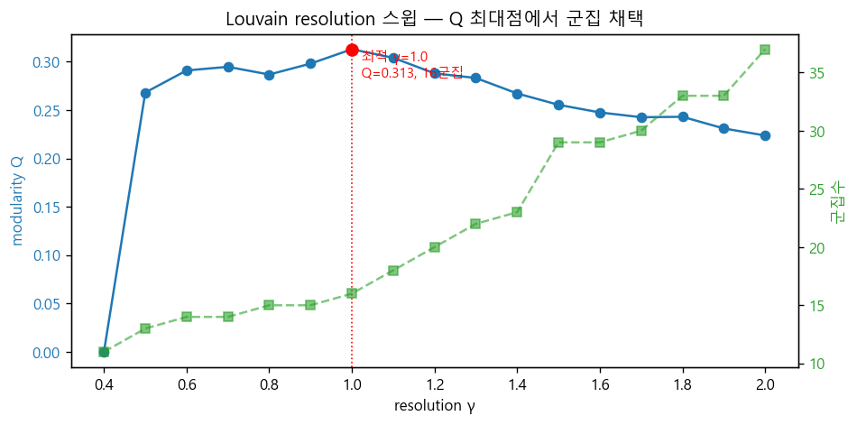
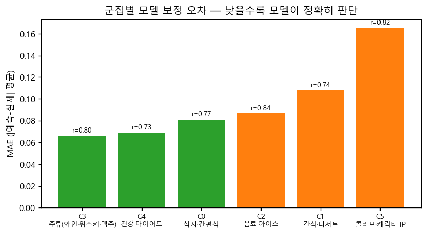
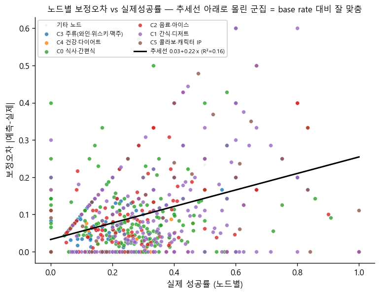
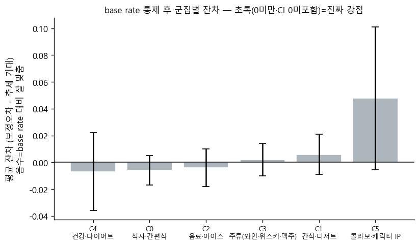

# 분석 C 심층 — 모델은 어떤 키워드 군집을 정확히 판단하는가
> 모델 `v2_sweepA` · 전체 상품 5,033개 · 운영 임계값 0.7049 · 분석 C(Louvain 군집) 심층 · Run All 자동 생성.
## 0. 분석 목적 · 배경
🎯 **목적**: 최종 모델이 *어떤 키워드 패턴(컨셉 군집)* 을 정확히 잡아내는가? — 군집별로 **실제 성공률 vs 모델 예측 성공률 산점도**를 그려 군집마다 보정도(calibration)를 비교한다. 산점도가 대각선에 붙는 군집 = 모델이 그 컨셉군 키워드를 신뢰성 있게 판단하는 영역.
**배경**: `network_eda_report.md`에서 모델 `v2_sweepA`가 중시한 엣지가 **동일 키워드(≥3)·IP(≥1)를 공유하는 상품-상품 유사 엣지**임을 확인했다(아래 가중치). 그래서 그 엣지를 만든 키워드·IP 노드만으로 이기종 서브네트워크를 구성(`keyword_network_eda_report.md`)했고, 본 보고서는 그 네트워크의 **Louvain 군집(분석 C)** 을 심층 분석하여 군집별로 **분석 D(실제 vs 예측 산점도)** 를 수행한다.
## 1. 배경 — 모델 성능 · 중시한 엣지 가중치
**split별 성능** (`network_eda_report.md` M0 인용):
| 분할   |   PR_AUC |   ROC_AUC |     F1 |   임계값 |
|:-------|---------:|----------:|-------:|---------:|
| train  |   0.7237 |    0.9076 | 0.6948 |   0.588  |
| val    |   0.588  |    0.8115 | 0.5741 |   0.5593 |
| test   |   0.6083 |    0.8314 | 0.6121 |   0.4535 |

**모델이 중시한 엣지 관계 (DiffMG α_r, 균등선 1/24=0.045)** — 유사상품(공유키워드)이 압도적, 다음이 유사상품(공유IP):
| 관계(한글)              | 관계_원본                    |    α_r |   균등대비(배) |
|:------------------------|:-----------------------------|-------:|---------------:|
| 유사상품(공유키워드)    | product__sim_kw__product     | 0.6136 |          13.5  |
| 역-유사상품(공유IP)     | product__rev_sim_ip__product | 0.1049 |           2.31 |
| 유사상품(공유IP)        | product__sim_ip__product     | 0.1035 |           2.28 |
| 역-유사상품(공유키워드) | product__rev_sim_kw__product | 0.0486 |           1.07 |

*그림: 24개 엣지 관계의 학습된 가중치 α_r — 막대가 균등선을 크게 넘는 유사상품(공유키워드·공유IP)만 신뢰 신호.*

> **test 분할 혼동행렬**: 원천 `learned_product_scores`에 split 컬럼이 없어 test-only 혼동행렬은 재구성 불가. 위 split별 성능표가 test 성능(PR-AUC 0.608·ROC-AUC 0.831·F1 0.612, 임계값 0.4535)을 담고, 본 심층분석은 전체 상품 기준이라 아래 전체(train+val+test) 혼동행렬 두 종(분석·배포 임계값)을 군집 분석의 주 근거로 쓴다.

**혼동행렬 — 전체(train+val+test), 분석용 THR=0.5593** (`network_eda_report.md` 인용):
| | 예측 실패 | 예측 성공 |
|---|---|---|
| 실제 실패 | 3044 | 792 |
| 실제 성공 | 216 | 981 |

**혼동행렬 — 전체, 배포 운영점 THR=0.7049** (본 노트북 라이브 계산; 산점도·군집 분석에 쓰는 임계값):
|           |   예측 실패 |   예측 성공 |
|:----------|------------:|------------:|
| 실제 실패 |        3412 |         424 |
| 실제 성공 |         478 |         719 |

*그림: 전체 데이터 Precision·Recall·F1 vs 임계값 (회색 점선=분석 임계 0.5593, 검정 점선=배포 운영점 0.7049).*
## 2. 서브네트워크 정보
모델이 정보를 길어 올리는 **기여 키워드·IP 노드**만으로 이기종 네트워크를 구성. 공동출현 엣지는 **키워드 ≥3 공유 상품쌍의 공유 키워드집합 내부 클리크**(strict), IP는 ≥1(피처)·≥2(엣지) 공유 기준.
- **노드 구성: keyword(속성) 1,297개 + IP 139개 = 총 1,436개** · 엣지 17,269개 · 최대 컴포넌트 99.3%.
- 전체망에서 **잘린 노드**: 기여 안 한 키워드 626개 / IP 77개 제외 (유사상품 형성에 기여한 적 없음).

**노드** (이기종 2종):
| 노드 타입      | 정의                                                         |   개수 |
|:---------------|:-------------------------------------------------------------|-------:|
| keyword (속성) | sim_kw 기여 키워드 — 키워드 ≥3 공유 상품쌍의 공유집합에 등장 |   1297 |
| ip             | sim_ip 기여 IP — IP ≥1 공유 상품쌍에 등장                    |    139 |

**노드 피처**:
| 피처                           | 정의                                                    |
|:-------------------------------|:--------------------------------------------------------|
| 실제 성공률                    | 이웃 상품(키워드/IP 보유 상품)이 실제로 성공한 비율     |
| 모델 예측 성공률               | 이웃 상품 중 모델이 성공으로 예측(확률≥0.7049)한 비율   |
| 예측−실제 격차                 | 양수=모델 과대평가(FP쪽) · 음수=과소평가(FN쪽) · 0=정확 |
| 낚인 실패(FP)/놓친 성공(FN) 수 | 이웃 상품 중 오분류 절대 개수                           |
| 트렌드                         | 트렌드 키워드 여부(IP 노드는 0)                         |
| 상품수(support)                | 집계에 쓰인 이웃 상품 수                                |

**엣지** (유사성=모델 중시 sim 쌍대, 원본=소속 관계):
| 엣지 타입        | 구성 규칙                                           |   개수 |
|:-----------------|:----------------------------------------------------|-------:|
| kw_cooc (유사성) | 키워드 ≥3 공유 상품쌍의 공유 키워드집합 내부 클리크 |  15171 |
| ip_cooc (유사성) | IP ≥2 공유 상품쌍의 공유 IP집합 내부 클리크         |     31 |
| trend_to (원본)  | 트렌드키워드 → 속성키워드                           |   1612 |
| ip_has_kw (원본) | IP → 보유 키워드                                    |    455 |
| ip_has_ip (원본) | IP → 연관 IP                                        |      0 |
## 3. Louvain 최적 군집 탐색
resolution γ를 0.4~2.0 스윕(seed=42 고정·재현성)하며 modularity Q와 군집수를 기록, **Q가 최대가 되는 partition을 채택**했다.

*그림: resolution γ에 따른 modularity Q(파랑)와 군집수(초록) — 빨간 점이 Q 최대(채택) 지점.*

**📌 결과** — 채택 γ=**1.0**, 군집수 **16개**, modularity **Q=0.313**(>0 → 뚜렷한 군집 구조).
## 4. 전체 네트워크 평균 성공률 (기준선)
군집별 적합도를 보기 전 기준선 — 전 노드의 **실제·예측 성공률 평균**. 각 군집을 이 평균과 비교한다.

> **평균격차 vs MAE**: 평균격차는 과대(+)/과소(−)가 상쇄된 *방향 편향*, MAE는 |예측−실제| 평균이라 *개별 노드 오차 크기*(항상 MAE≥|평균격차|). 본 분석의 정확도(컨셉을 정확히 판단하는가)는 MAE로 본다.

| 대상             |   노드수 |   실제성공률 |   예측성공률 |   평균격차 |   MAE |
|:-----------------|---------:|-------------:|-------------:|-----------:|------:|
| 전체(keyword+IP) |     1436 |        0.251 |        0.226 |     -0.025 | 0.104 |
| keyword          |     1297 |        0.24  |        0.213 |     -0.028 | 0.102 |
| IP               |      139 |        0.353 |        0.351 |     -0.002 | 0.122 |

> 상품 기저 성공률(라벨)은 0.238. 노드 기준 평균 실제성공률(전체 0.251)은 *키워드/IP 보유 상품* 집계라 상품 기저와 다르며, 네트워크 노드의 평균적 성패 수준을 나타낸다. 모델 예측 평균(0.226)이 실제 평균보다 낮으면 전반적 과소.
## 5. 군집별 적합도(보정도)
🎯 각 군집 노드(키워드+IP, 상품수≥5)의 **실제 성공률 vs 모델 예측 성공률** 차이로 모델이 그 컨셉군을 얼마나 정확히 판단하는지 측정. **MAE(평균 |예측−실제|)가 낮을수록 정확**, r은 군집 내 상관.

*그림: 군집별 보정 오차 MAE(낮을수록 정확) — 막대 위 r은 군집 내 실제↔예측 상관.*

**군집별 적합도 (MAE 오름차순 = 모델이 정확히 판단하는 컨셉군):**
|   군집 | 군집명                 |   노드수 |   MAE |     r |   평균격차 |   정확포착비율 |   실제성공률 |   예측성공률 | 주도관계      |
|-------:|:-----------------------|---------:|------:|------:|-----------:|---------------:|-------------:|-------------:|:--------------|
|      3 | 주류(와인·위스키·맥주) |      104 | 0.066 | 0.8   |     -0.045 |           0.51 |        0.12  |        0.084 | 유사주도(96%) |
|      4 | 건강·다이어트          |       37 | 0.069 | 0.731 |     -0.012 |           0.57 |        0.252 |        0.213 | 유사주도(90%) |
|      0 | 식사·간편식            |      305 | 0.081 | 0.774 |      0.005 |           0.49 |        0.24  |        0.254 | 유사주도(89%) |
|      2 | 음료·아이스            |      157 | 0.087 | 0.837 |     -0.05  |           0.46 |        0.263 |        0.227 | 유사주도(93%) |
|      1 | 간식·디저트            |      229 | 0.108 | 0.744 |     -0.061 |           0.46 |        0.303 |        0.247 | 유사주도(82%) |
|      5 | 콜라보·캐릭터 IP       |       29 | 0.165 | 0.816 |      0.04  |           0.28 |        0.383 |        0.392 | 속성주도(35%) |

> 주도관계 = 군집 내부 엣지 중 유사성(공동출현) 비율 ≥50%면 *유사주도*(모델 메커니즘), 미만이면 *속성주도*(소속 관계).
## 6. base rate 통제 — 잔차 보정오차 (진짜 강점 가려내기)
🎯 **왜**: §5의 MAE는 군집 성공률(base rate)을 거의 그대로 따라간다 — 주류(성공률 0.12)·MAE 0.066 … 콜라보(0.38)·MAE 0.165. 그래서 낮은 MAE가 *모델 실력*인지 *저성공이라 다 실패로 찍으면 맞는* 카테고리인지 구분되지 않는다. base rate를 통제하고도 더 잘 맞히는 군집만 진짜 강점으로 인정한다.

🔬 **과정** (분석 단위 = 개별 노드 1,436개, 군집 평균 아님):
1. 노드마다 x=실제 성공률, y=보정오차 |예측−실제|.
2. 전 노드 직선 회귀로 또래(같은 성공률대) 노드가 으레 갖는 오차 추세선을 구함 → **보정오차 ≈ 0.033 + 0.222·실제성공률** (기울기 +0.222 > 0 → 성공률이 높을수록 오차가 커지는 base-rate 효과를 정량 확인).
   - **추세선 설명력(R²)**: 노드 단위 R²=0.160 — 개별 노드 보정오차는 노이즈가 커 base rate로 일부만 설명되나, 기울기는 통계적으로 유의(p=1e-34). **군집평균 단위 R²=0.740** — §5 군집 MAE 순위는 base rate가 거의 지배함을 확인.
3. 노드 **잔차 = 실제 보정오차 − 추세선** (음수=또래보다 잘 맞춤). 군집별 평균잔차 ± 95% 신뢰구간(CI)으로 0과 유의하게 다른지 판정: CI 전체<0 → **진짜 강점** / CI가 0 포함 → **구분 불가**(낮은 MAE는 base rate 효과) / CI 전체>0 → **오히려 약함**.

📊 **결과**

*그림: 노드별 보정오차(세로) vs 실제 성공률(가로)과 추세선 — 점이 선 아래로 몰린 군집이 base rate 대비 잘 맞춘 군집.*

*그림: base rate 통제 후 군집별 평균 잔차(±95% CI) — 막대가 0 아래이고 CI가 0을 안 넘으면(초록) 통계적으로 유의한 진짜 강점.*

**군집별 잔차표 (잔차 오름차순 = base rate 통제 후 정확한 순):**
|   군집 | 군집명                 |   노드수 |   평균보정오차 |   기대오차 |   잔차 |   CI95 | 판정      |
|-------:|:-----------------------|---------:|---------------:|-----------:|-------:|-------:|:----------|
|      4 | 건강·다이어트          |       37 |          0.069 |      0.076 | -0.007 |  0.029 | 구분 불가 |
|      0 | 식사·간편식            |      305 |          0.081 |      0.088 | -0.006 |  0.011 | 구분 불가 |
|      2 | 음료·아이스            |      157 |          0.087 |      0.091 | -0.004 |  0.014 | 구분 불가 |
|      3 | 주류(와인·위스키·맥주) |      104 |          0.066 |      0.064 |  0.002 |  0.012 | 구분 불가 |
|      1 | 간식·디저트            |      229 |          0.108 |      0.102 |  0.006 |  0.015 | 구분 불가 |
|      5 | 콜라보·캐릭터 IP       |       29 |          0.165 |      0.117 |  0.048 |  0.053 | 구분 불가 |

✅ **결론**
- **base rate를 통제해도 유의하게 정확한 군집(진짜 강점)**: 없음.
- **구분 불가(낮은 MAE가 base rate 효과)**: 건강·다이어트, 식사·간편식, 음료·아이스, 주류(와인·위스키·맥주), 간식·디저트, 콜라보·캐릭터 IP — 이 군집들은 잘 학습했다고 강조하면 안 된다.
- **base rate를 통제하면 어떤 군집도 유의하게 정확하지 않다** — §5 MAE 우열은 사실상 성공률 차이의 반영이며, 특정 컨셉군을 잘 학습했다는 강점 주장은 이 데이터로는 성립하지 않는다.
## 7. 군집별 산점도 — Next로 넘겨보기
🎯 군집마다 **실제 성공률(가로) vs 모델 예측 성공률(세로)** 산점도. 점이 대각선에 붙을수록 그 컨셉군을 정확히 판단. 점 색은 아래 **격차 밴드**, 라벨은 겹치지 않게 자동 배치.

👉 **[군집별 산점도 카루셀 열기 (Prev/Next로 넘김)](report_assets/cluster_scatter_carousel.html)** — 좌우 화살표 키 또는 버튼으로 군집을 넘겨가며 비교. (세로 나열 대신 한 화면에서 전환.)

**카루셀 프레임 구성** (각 군집 = 한 프레임):
| 순서 | 군집 | 노드수 | MAE | r | 한 줄 해석 |
|---|---|---|---|---|---|
| 1 | C3 「주류(와인·위스키·맥주)」 | 104 | 0.066 | 0.8 | 대각선에 밀착 → 정확 판단 |
| 2 | C4 「건강·다이어트」 | 37 | 0.069 | 0.731 | 대각선에 밀착 → 정확 판단 |
| 3 | C0 「식사·간편식」 | 305 | 0.081 | 0.774 | 대체로 정합 |
| 4 | C2 「음료·아이스」 | 157 | 0.087 | 0.837 | 대체로 정합 |
| 5 | C1 「간식·디저트」 | 229 | 0.108 | 0.744 | 편차 큼 → 보정 약함 |
| 6 | C5 「콜라보·캐릭터 IP」 | 29 | 0.165 | 0.816 | 편차 큼 → 보정 약함 |

### 색상(격차 밴드) 기준 — 예측−실제 격차 (정확 = ±0.10, 전체 네트워크 MAE 0.104 기준)
| 밴드 | 격차 범위 | 의미 |
|---|---|---|
| 과대평가 | > +0.10 | 예측>실제 — 모델 과대평가 (FP 위험) |
| 정확(±0.10) | -0.10 ~ +0.10 | 예측≈실제 (신뢰 가능) |
| 과소평가 | < -0.10 | 예측<실제 — 모델 과소평가 (FN 위험) |

> **군집별 과대평가·정확·과소평가 데이터 개수와 노드 목록**은 카루셀(위 링크)의 각 산점도 아래에 표시된다.
## 8. 결론
- **raw 보정오차(MAE) 기준** 가장 낮은 군집은 C3 「주류(와인·위스키·맥주)」(MAE=0.066)이나, 이는 base rate에 오염된 순위다(§6).
- **base rate 통제 후 진짜 강점**: 유의 군집 없음 — 컨셉군별 우열은 성공률 차이의 반영.
- **raw MAE 최대(가장 약해 보이는) 군집**: C5 「콜라보·캐릭터 IP」 (MAE=0.165) — 단 §6에서 이 역시 base rate 통제 시 0과 유의차 없음.
- 대부분 군집이 *유사주도*로 묶여 모델 메커니즘(유사상품 이웃 성패)과 일치한다. 다만 base rate를 통제하면(§6) **컨셉군 간 보정 신뢰도 차이가 통계적으로 사라지므로**, 특정 군집을 잘 잡는 강점으로 단정할 수 없다. 실무에선 키워드-군집 단위 보정은 균일하게 보고, 흥행 상품 선별이 목적이면 상품 단위 판별력(PR-AUC)을 별도 검증한다.
## 한계
- 전체 상품 기준(train 예측은 적합치라 보정 오차를 낙관적으로 만들 수 있음). 실제 성공률은 라벨 기반이라 누수 무관.
- 군집별 MAE/r은 상품수≥5 노드(키워드+IP)만 집계 — 단일 IP 군집(n=1)은 산점도 제외(요약표에만 표기).
- 보정도는 상관 진단이지 인과 확정이 아니다.
- §6 잔차 분석은 base rate(F1)만 통제했고 표본수(support) 효과는 미통제 — support까지 넣어도 결론이 유지되는지는 추가 robustness 과제.
