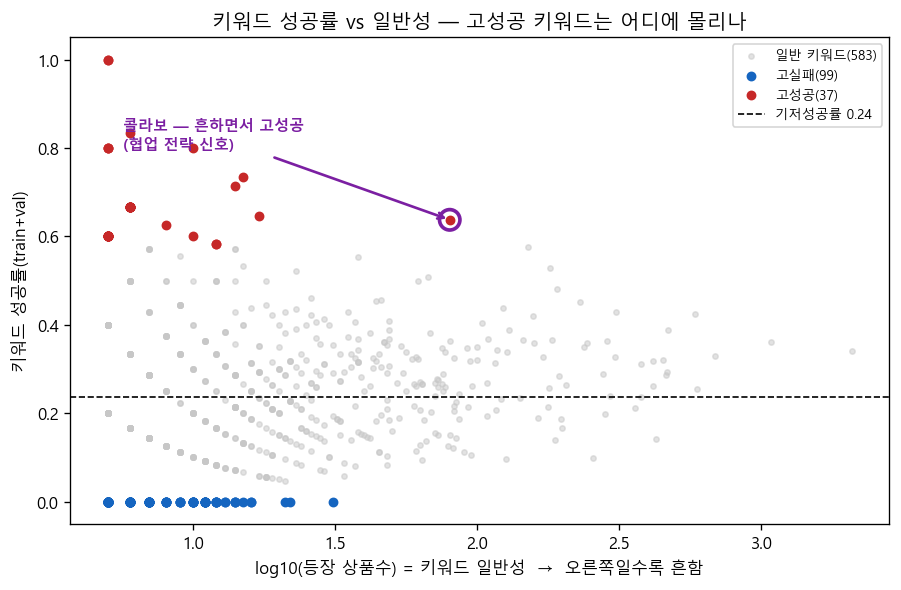
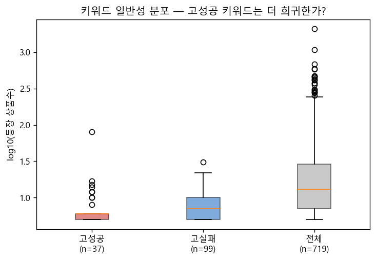
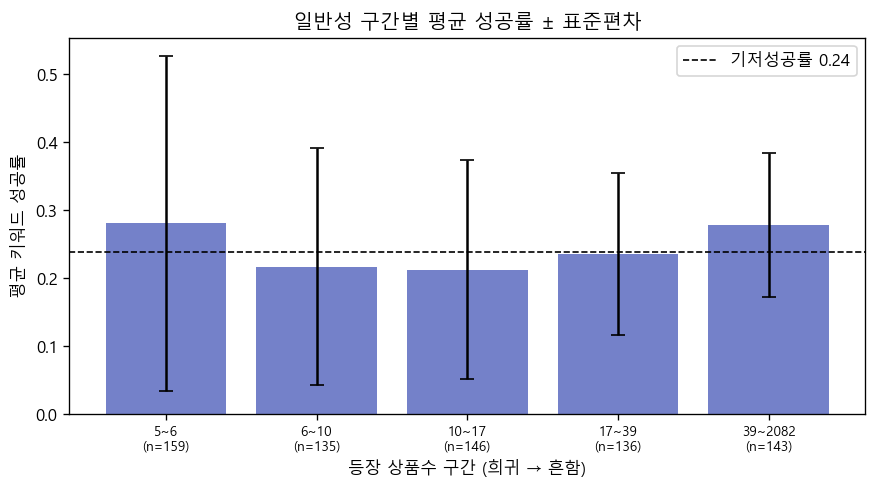
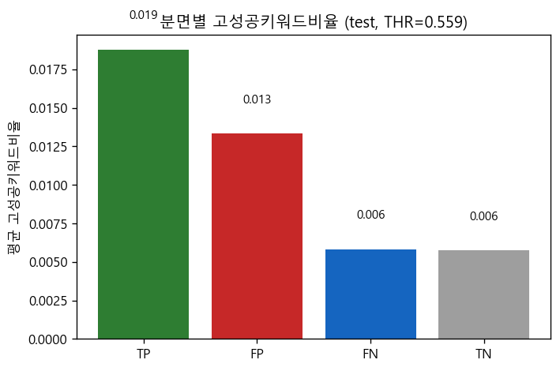

# 키워드 일반성 분석 — 고성공키워드는 '흔한' 키워드인가?

> v2_sweepA · train+val 라벨만 · 노트북 `keyword_generality.ipynb` Run All 자동 생성.

## 0. 분석 개요

**소목적**: 고성공키워드(성공률 상위 5%)가 여러 상품에 두루 쓰이는 *흔한* 키워드인지, 소수 상품에만 붙는 *희귀·특이* 키워드인지 규명.

**상위목적과의 연결**: 모델은 유사상품(공유키워드/IP)으로 성패를 가른다(`network_eda_report.md` M0·M3). 그렇다면 "성공을 끌어올리는 키워드"의 성격을 알면 **FN(놓친 성공)·FP(낚인 실패)** 가 왜 생기는지 더 깊이 설명된다.

**정의(재사용)**: 키워드 성공률 = (train+val에서 그 키워드 보유 상품 중 성공 비율), 등장상품수≥5만 분석. 고성공=성공률 상위5%(≥0.58, 37개)·고실패=하위5%(≤0.00, 99개). 일반성=등장 상품수. 기저성공률=0.238.

## A·B. 성공률 vs 일반성 (산점도)

### 🔬 분석/그림

Spearman(일반성,성공률)=**0.097**, Pearson(log10 일반성,성공률)=**0.065**.

**📌 볼 점** — 흔한 키워드(오른쪽)일수록 성공률이 기저(0.24) 근처로 수렴하고, **고성공(빨강)·고실패(파랑) 극단값은 왼쪽(희귀 영역)에 몰린다**. 흔한 키워드는 거의 모든 상품에 붙어 성공/실패를 가르지 못한다. 단 우측 끝의 **`콜라보`(등장상품수 80·성공률 0.64, 보라 원)**는 예외 — 흔하면서도 고성공인 *협업 전략 신호*다.

## C. 일반성 분포 — 고성공 vs 고실패 vs 전체

**📌 볼 점** — 등장상품수 중앙값: 전체 **13**, 고성공 **6**, 고실패 **7**. 고성공 키워드 중앙값이 전체보다 낮다(더 희귀).

## D. 일반성 구간별 평균 성공률

**📌 볼 점** — 가장 희귀한 구간 평균성공률 0.281(편차 0.247) vs 가장 흔한 구간 0.278(편차 0.106). **흔할수록 성공률이 기저로 수렴하고 편차가 줄어든다** = 흔한 키워드엔 성패 신호가 거의 없다.

## E. FN·FP 연결 — 분면별 고성공키워드비율

**📌 볼 점** — 분면별 평균 고성공키워드비율: TP 0.019 / FP 0.013 / FN 0.006 / TN 0.006. 절대값이 모두 작은 이유는 고성공 키워드가 **희귀**해 한 상품이 가질 확률 자체가 낮기 때문. 그래도 예측성공(TP·FP)이 예측실패(FN·TN)보다 높다.

## 종합 — 소목적 답 · FN/FP 함의

- **소목적 답**: 아니다 — **고성공키워드는 오히려 희귀·특이한 키워드**다. 흔한 키워드(간식·달콤 등)는 성공률이 기저로 수렴해 변별력이 없고, 성패를 가르는 고성공 키워드는 소수 상품에만 붙는 **특이 신호**다.

- **모델 학습 해석**: 모델이 성공을 끌어올리는 힘은 "흔한 키워드를 많이 가졌나"가 아니라 "**드물지만 성공과 강하게 결부된 특이 키워드/유사 성공작과의 연결**"에서 나온다(M0 α_r의 sim_kw·sim_ip 우위와 정합).

- **FN(놓친 성공)**: 고성공키워드비율이 가장 낮다 → 신규·이질 성공작은 *특이 성공 키워드가 없어* 평범해 보여 모델이 못 끌어올린다.

- **FP(낚인 실패)**: 고성공 키워드 보유는 TP보다 약하지만, 유사상품·트렌드 외형으로 점수가 올라가 과대평가된다(M1~M3와 일관).

- **고성공 키워드 37개 · 보유 상품 340개 — 예시 20(성공률/보유상품수)**: 관람(1.00/5), 로코모코(1.00/5), 알포트(0.83/6), 하와이(0.80/10), 고창(0.80/5), 레드벨벳(0.80/5), 맥스봉(0.80/5), 띠부씰(0.73/15), 커스터드(0.71/14), 녹진함(0.67/6), 데이지(0.67/6), 미각(0.67/6), 미역(0.67/6), 발효(0.67/6), 에일(0.67/6), 타우린(0.67/6), 트로피컬(0.67/6), 프링글스(0.67/6), 홈런(0.67/6), 후르츠(0.65/17).

- **고실패 키워드 99개 · 보유 상품 834개 — 예시 20(성공률/보유상품수)**: 캔(0.00/31), 다리(0.00/22), 찌개(0.00/21), 소다(0.00/16), 블렌디드(0.00/16), 하림(0.00/15), 빅(0.00/14), 곰(0.00/14), 식빵(0.00/14), 조니워커(0.00/13), 페어링(0.00/13), 모카(0.00/12), 하인즈(0.00/12), 주먹밥(0.00/12), 복날(0.00/12), 한우(0.00/12), 맥시칸(0.00/11), 모스카토(0.00/11), 해장(0.00/11), 짐빔(0.00/11).

- **참고 · 가장 흔한 키워드(등장상품수)**: 간식(2082), 달콤(1080), 야식(687), 디저트(593), 부드러움(582), 고소(469), 식사(464), 초코(462) → 대부분 성공률이 기저 부근.

- **IP 포함 여부**: 이 분석의 키워드는 keyword 노드(상품 키워드)로 **IP 노드와 별개**다. 키워드 vocab 1923개 중 IP명과 겹치는 건 11개(0.6%)뿐 — 고성공∩IP=[], 고실패∩IP=[].

- **한계**: train+val 기준 집계(소표본 키워드 분산 큼)·상관≠인과·등장상품수≥5 컷오프 의존.