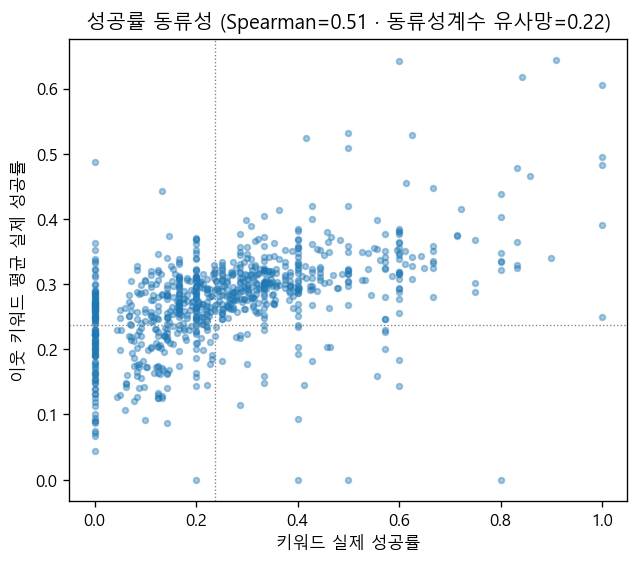
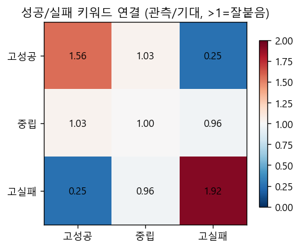
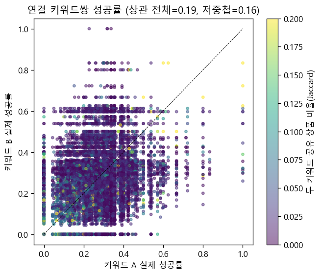
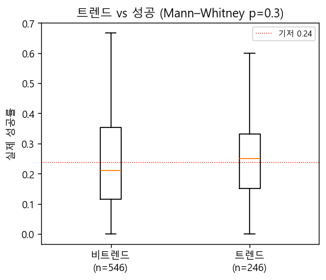
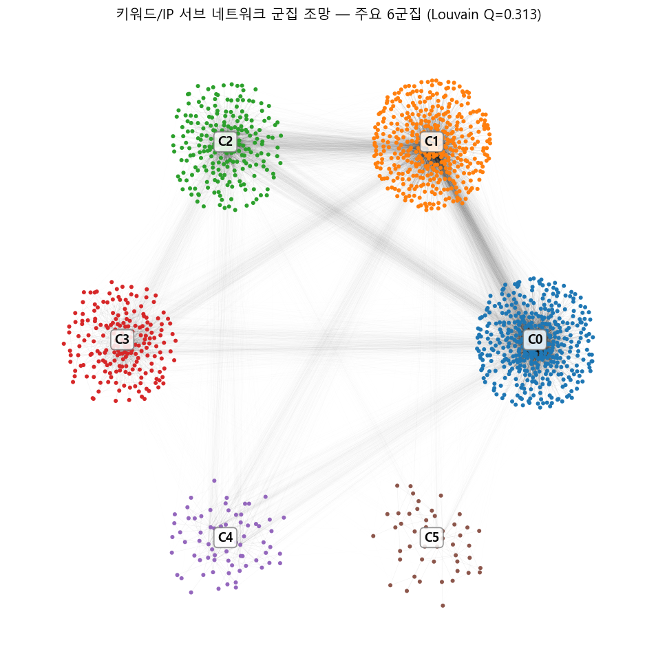
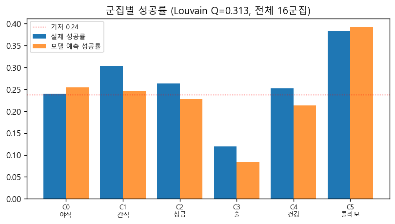
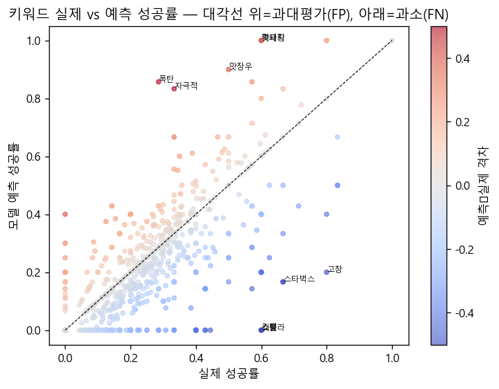

# 키워드/IP 이기종 네트워크 EDA — 성공/실패 패턴 & 모델 오분류 진단

> 모델 `v2_sweepA` · 전체 상품 5,033개 · 운영 임계값 0.7049 · 노드=기여 키워드 1297+IP 139 · Run All 자동 생성.

## 0. 분석 개요

모델은 유사상품(공유키워드 `sim_kw`·공유IP `sim_ip`)으로 성패를 가른다. 분석 단위를 그 엣지를 만든 **속성·IP 노드**로 옮겨, 키워드 관점에서 성패 패턴과 오분류를 본다. 공동출현 엣지는 **키워드 ≥3 공유 상품쌍의 공유집합**(모델 임계값 기여분)으로 구성, 원본 관계(`trend_to`·`ip_has_kw`·`ip_has_ip`)는 관계 태그와 함께 보존.

- 네트워크: **1,436 노드 · 17,269 엣지**, 최대 컴포넌트 99.3%. 기여 안 한 키워드 626개 제외.

- 전 상품 혼동: 정답성공 719 · 낚인실패(FP) 424 · 놓친성공(FN) 478 · 정답실패 3412 (기저성공률 0.238).

### 분석 구성 — 각 분석의 목적

| 분석 | 핵심 질문(목적) |
|---|---|
| **A. 동류성** | 성공/실패 키워드가 서로 끌리나 회피하나 → 키워드 공간이 성패로 분리돼 있는가 |
| **B. 트렌드** | 트렌드 여부가 성공과 상관있나 → 트렌드를 성공 신호로 쓸 수 있는가 |
| **C. 군집** | 키워드가 의미 군집으로 갈리고 군집마다 성패가 다른가 → 어떤 컨셉군이 성공/실패인가 |
| **D. 모델·오분류** | 모델이 어떤 키워드를 과대/과소/정확 평가하나 → FP·FN 유발 키워드 장부 |

### 네트워크 기초 통계

**노드** — 이기종 2종, 총 1436개:

| 노드 타입      | 정의                                                         |   개수 |
|:---------------|:-------------------------------------------------------------|-------:|
| keyword (속성) | sim_kw 기여 키워드 — 키워드 ≥3 공유 상품쌍의 공유집합에 등장 |   1297 |
| ip             | sim_ip 기여 IP — IP ≥1 공유 상품쌍에 등장                    |    139 |

**노드 피처** — 각 노드(키워드/IP)가 보유:

| 피처                                | 정의                                                    |
|:------------------------------------|:--------------------------------------------------------|
| 실제 성공률                         | 이웃 상품(키워드/IP 보유 상품)이 실제로 성공한 비율     |
| 모델 예측 성공률                    | 이웃 상품 중 모델이 성공으로 예측(확률≥0.7049)한 비율   |
| 낚인 실패(FP) 수 / 놓친 성공(FN) 수 | 이웃 상품 중 오분류 절대 개수                           |
| FP율 / FN율                         | 오분류 수를 이웃 수로 나눈 비율(degree 보정)            |
| 예측−실제 격차                      | 양수=모델 과대평가(FP쪽) · 음수=과소평가(FN쪽) · 0=정확 |
| 트렌드                              | 트렌드 키워드 여부(IP 노드는 0)                         |
| 상품수(support)                     | 집계에 쓰인 이웃 상품 수                                |

**엣지** — 총 17269개(유사성=모델이 중시한 sim 쌍대, 원본=소속 관계):

| 엣지 타입        | 구성 규칙                                           |   개수 |
|:-----------------|:----------------------------------------------------|-------:|
| kw_cooc (유사성) | 키워드 ≥3 공유 상품쌍의 공유 키워드집합 내부 클리크 |  15171 |
| ip_cooc (유사성) | IP ≥2 공유 상품쌍의 공유 IP집합 내부 클리크         |     31 |
| trend_to (원본)  | 트렌드키워드 → 속성키워드                           |   1612 |
| ip_has_kw (원본) | IP → 보유 키워드                                    |    455 |
| ip_has_ip (원본) | IP → 연관 IP                                        |      0 |

## A. 성공/실패 키워드의 동류성

🎯 **목적**: 성공률이 비슷한 키워드끼리 연결되는지(동류) 섞이는지 보아, 키워드 공간이 성패로 분리돼 있는지 확인한다.

*그림: 키워드의 실제 성공률(가로)과 그 이웃 키워드들의 평균 실제 성공률(세로) — 우상향이면 성공 키워드끼리 모인다는 뜻.*

*그림(혼합행렬): 키워드를 실제 성공률로 고성공(상위10%·≥0.50)·중립·고실패(≤0.10) 3계급으로 나눈 뒤, 두 계급을 잇는 공동출현 엣지 수(관측)를 연결을 무작위로 섞었을 때 기대되는 수(계급별 연결총량의 곱÷전체)로 나눈 값. >1(빨강)=우연보다 자주 연결(끌림), <1(파랑)=덜 연결(회피). 대각선이 빨강이고 고성공×고실패가 파랑이면 성패가 동류로 분리된 것.*

**📌 결과** — 동류성계수(유사성망)=**+0.22**(양수=동류), 자기 vs 이웃 성공률 Spearman=**+0.51**. 혼합 관측/기대: 고성공–고성공 **1.56배**, 고실패–고실패 **1.92배**, 고성공–고실패 **0.25배**.

**📌 "공유 키워드끼리 묶으면 성공률이 비슷해지는 인공효과 아닌가?" 검증** — 답: 아니다. 연결된 키워드쌍의 실제 성공률 차이는 평균 **0.131**(동일하지 않음). 연결돼도 공유 상품은 중앙값 **0.016**(대부분 거의 안 겹침)뿐이고, **공유 상품이 거의 없는 쌍만 봐도 성공률 상관이 0.192→0.163로 유지**된다 → 동류성은 구성 산물이 아니라 진짜 신호.

*그림: 연결된 두 키워드의 실제 성공률(점=키워드쌍, 색=둘이 공유하는 상품 비율) — 색이 옅은(공유 적은) 점들도 대각선 주변에 모여 동류성이 공유상품 탓이 아님을 보임.*

✅ **결론** — 성공 키워드는 성공끼리, 실패는 실패끼리 뭉치고 **서로 회피**한다(동류 분리). 한 클리크 안 키워드들이 *모두 똑같이* 성공적인 건 아니며, 이 분리는 모델이 유사상품 이웃의 성패로 점수를 가르는 메커니즘과 정합.

## B. 트렌드 여부 ↔ 성공

🎯 **목적**: 트렌드 키워드라는 사실 자체가 성공과 상관있는지 검정해, 트렌드를 성공 예측 신호로 쓸 수 있는지 판단한다.

*그림: 트렌드 키워드와 비트렌드 키워드의 실제 성공률 분포 비교(상자그림).*

**📌 결과** — 트렌드 실제성공률 중앙 0.250(n=246) vs 비트렌드 0.209(n=546), Mann–Whitney p=**0.296**, 상관 r=**-0.017**.

✅ **결론** — 유의한 차이 없음(p=0.296). **트렌드 플래그 자체는 키워드 성공과 거의 무관** — 성공을 가르는 건 트렌드 여부가 아니라 동류 군집·특이 성공 키워드.

## C. Louvain 군집

🎯 **목적**: 키워드가 의미 있는 컨셉 군집으로 나뉘는지, 군집마다 성패 수준이 다른지 보아 "성공하는 컨셉군"을 찾는다.

*그림: 서브 네트워크 전체를 force layout으로 펼치고 노드 색을 군집별로 칠한 조망 — 색 덩어리가 또렷이 분리돼 보이면 군집이 잘 나뉜 것(소형 군집은 회색).*

*그림: 주요 군집별 평균 실제 성공률과 모델 예측 성공률(막대) — 군집마다 성공 수준이 다름을 보임.*

**📌 결과** — 총 16개 군집, **modularity Q=0.313**(뚜렷한 구조). 전 군집 프로파일(주도관계=유사성/속성 중 무엇으로 묶였나):

|   군집 | 군집명                 |   n |   실제성공률 |   예측성공률 |   격차 |   FP |   FN |   트렌드 | 주도관계      | 대표                                                          |
|-------:|:-----------------------|----:|-------------:|-------------:|-------:|-----:|-----:|---------:|:--------------|:--------------------------------------------------------------|
|      0 | 식사·간편식            | 454 |        0.24  |        0.254 |  0.014 | 1316 | 1160 |     0.24 | 유사주도(89%) | 야식, 식사, 매콤, 간편, 고기, 짭조름함                        |
|      1 | 간식·디저트            | 427 |        0.303 |        0.247 | -0.056 | 1516 | 1708 |     0.22 | 유사주도(82%) | 간식, 달콤, 디저트, 부드러움, 고소, 초코                      |
|      2 | 음료·아이스            | 232 |        0.263 |        0.227 | -0.036 |  477 |  623 |     0.22 | 유사주도(93%) | 상큼, 음료, 아이스크림, 아이스, 딸기, 시즌                    |
|      3 | 주류(와인·위스키·맥주) | 197 |        0.12  |        0.084 | -0.037 |  140 |  297 |     0.1  | 유사주도(96%) | 술, 와인, 위스키, 풍미, 레드, 선물                            |
|      4 | 건강·다이어트          |  69 |        0.252 |        0.213 | -0.039 |   77 |   95 |     0.17 | 유사주도(90%) | 건강, 다이어트, 샐러드, 단백질, 샌드위치, 견과류              |
|      5 | 콜라보·캐릭터 IP       |  47 |        0.383 |        0.392 |  0.009 |   90 |   46 |     0    | 속성주도(35%) | 콜라보, KBO, 맛삼춘, 케이팝데몬헌터스, 흑백요리사, 캐치티니핑 |
|      6 | 동아                   |   1 |        0.444 |        0.222 | -0.222 |    1 |    3 |     0    | -             | 동아                                                          |
|      7 | 먼작귀                 |   1 |        0     |        0     |  0     |    0 |    0 |     0    | -             | 먼작귀                                                        |
|      8 | 서울대                 |   1 |        0     |        0     |  0     |    0 |    0 |     0    | -             | 서울대                                                        |
|      9 | 에반게리온             |   1 |        0     |        0     |  0     |    0 |    0 |     0    | -             | 에반게리온                                                    |
|     10 | 오징어게임             |   1 |        0     |        0     |  0     |    0 |    0 |     0    | -             | 오징어게임                                                    |
|     11 | 이정후                 |   1 |        0.5   |        0.733 |  0.233 |    8 |    1 |     0    | -             | 이정후                                                        |
|     12 | 짱구                   |   1 |        0.077 |        0     | -0.077 |    0 |    1 |     0    | -             | 짱구                                                          |
|     13 | 피스마이너스원         |   1 |        0.5   |        0     | -0.5   |    0 |    1 |     0    | -             | 피스마이너스원                                                |
|     14 | 피크민                 |   1 |        0.6   |        0.6   |  0     |    0 |    0 |     0    | -             | 피크민                                                        |
|     15 | 해리포터               |   1 |        0.167 |        0.167 |  0     |    0 |    0 |     0    | -             | 해리포터                                                      |

**군집별 전체 노드 (키워드·IP, 상품수 내림차순)**

- **C0 「식사·간편식」** (n=454, 유사주도(89%)): 야식, 식사, 매콤, 간편, 고기, 짭조름함, 밥, 치즈, 안주, 닭, 식감, 김밥, 면, 치킨, 쫄깃함, 도시락, 담백, 콜라, 소스, 라면, 계란, 볶음, 마요, 국물, 버거, 감칠맛, 감자, 김치, 소시지, 돼지, 마늘, 참치, 삼각, 점심, 탱글함, 불고기, 햄, 소고기, 고추, 컵, 국, 오뚜기, 맛, 반찬, 아삭함, 어묵, 닭가슴살, 피자, 옥수수, 간장, 불닭, 만두, 새우, 양념, 오징어, 갈비, 떡볶이, 토마토, 제육, 비빔, 파스타, 불, 동원(IP), 유부, 덮밥, 탕, 직화, 갈릭, 소, 장, 우동, 즉석, 초밥, 튀김, 해산물, 채소, 비비고, 육즙, 든든, 한식, 꼬치, 국수, 명절, 돈까스, 다리, 농심, ?, 스팸, 닭다리, 양파, 순살, CJ, 강정, 스테이크, 국산, 체다, 김, 구이, 핫도그, 정식, 마라, 찌개, 보양식, 청양, 카레, 베이컨, 분식, 페퍼, 왕, 육수, 더블, 짬뽕, 맛장우, 야채, 교자, 모짜렐라, 하림, 함박, 띠부씰, 저녁, 짜장, 참깨, 1인, 곰, 가득, 신라면, 칠리, 요리, 패티, 참기름, 미트, 멸치, 트러플, 크리스피, 대파, 두부, 주먹밥, 데리야끼, 가쓰오부시, 바베큐, 버섯, 사골, 납작, 클래식, 후추, 명란, 전주, 한상, 까르보나라, 후랑크, 냉면, 복날, 핫바, 한우, 햄버거, 국밥, 닭강정, 누들, 와사비, 스파게티, 타코, 포크, 훈연, 크래미, 따뜻, 당면, 얼큰함, 맥시칸, 시리즈, 삼겹살, 부대, HEYROO, 해장, 바질, 케이준, 들기름, 캠핑, 나물, 안유성(IP), 한돈, 소바, 반반, 권성준(IP), 중식, 올리브, 육포, 페퍼로니, 먹태, 반숙, 볶이, 할라피뇨, 핫, 디즈니(IP), 구움, 정통, 정성, 크랩, 순대, 삼양, 깊은맛, 그릴, 오븐, 쟌슨빌, 잡채, 칼국수, 닭갈비, 훈제, 투움바, 오일, 히밥(IP), 솔트, 한가위, 말이, 부리또, 메밀, 오리, 치폴레, 파마산, 그라탕, 쌀쌀함, 디진다 돈까스(IP), 무, 비엔나, 스리라차, 마파, 로스트, 라이트, 폭탄, 두께감, 당근, 명태, 미역, 묵은지, 스프, 홈런, 비건, 곱창, 화끈함, 플래터, 최강록(IP), 된장, 흑, 한끼, 미국, 명장, 맥스봉, 모둠, 콕콕콕(IP), 랩, 닭발, 족발, 자극적, 조림, 삼계탕, 브리또, 머스타드, 막국수, 냉동, 프랑크, 땡초, 등심, 육개장, 다이닝, 라구, 다이긴죠(IP), 미노리키친(IP), 후라이드, 주토피아(IP), 태국, 찜, 카츠, 껍데기, 만찢남(IP), 미정당(IP), 흑돼지, 춘천, 큰컵, 케찹, 의성, 윙, 잡곡, 대게, 대패, 이자카야, 파, 미노리키친, 문어, 슬라이스, 쌈장, 순두부, 수제비, 맛자랑, 미나리, BBQ, 밥도둑, 사발, 그릴리, 진미채, 너겟, 키친, 창녕, 쫄면, 파우치, 막창, 팔도, 깡, 맥반석, 맛집, 한입, 봉, 고메, 헬리녹스(IP), 황태, 목살, 안심, 한마리, 규동, 하랜띵스, 차돌박이, 찐, 장어, 장충동왕족발(IP), 용가리, 포기, 장조림, 열무, 영희네, 풀드, 깐풍기, 육향, 잠발라야, 이모카세(IP), 돈, 기사식당(IP), 꼬들함, 김장, LA, 숏다리, 알리오올리오, 안동, 비오는날, 샹궈, 명가, 슴슴함, 무국, 볼케이노, 한촌설렁탕(IP), 건더기, 고르곤졸라, 홀그레인, 해장국, 백숙, 대전, 도가니, 돈코츠, 조리, 딱지장, 위로, 울트라, 떠먹는, 일식, 라멘, 마카로니, 마쏘킥, 오돌뼈, 푸팟퐁, 퍽퍽, 팟카오무쌉, 울진, 양상추, 난, 단무지, 짜파게티, 총각, 너비아니, 진로, BHC(IP), 깻잎, 까스, 깐부, 광천, 후라이, 휴게소, 오뎅(IP), 리락쿠마(IP), 매드포갈릭(IP), 설성목장(IP), 오늘뭐먹지(IP), 온더고(IP), 장수회관(IP), 베트남, 히말라야, 테라오카, 꼬막, 나시고랭, 낙지, 남도, 칼, 칼제비, 쿠캣, 클레오파트라, 킬바사, 타마고, 청경채, 축구, 늘어남, 닭꼬치, 종가, 진라면, 데친, 독일, 전라도, 조개, 동파육, 이금기, 페스토, 풀, 풍성함, 왕컵, 우거지, 마녀, 마멜, 멘치, 애플하우스, 야끼소바, 양식, 얼라이브, 열, 오마카세, 오모리, 피클, 필리, 굴, 아라비아따, 말복, 맛다시, 맛요일, 순후추, 슈퍼스타, 스지, 실비, 사천, 뷔페, 미소, 민물, 바싹, 함흥, 게티, 고랭, 골뱅이, 하정우(IP), 떡볶퀸(IP), 강된장, 가락국수

- **C1 「간식·디저트」** (n=427, 유사주도(82%)): 간식, 달콤, 디저트, 부드러움, 고소, 초코, 크림, 빵, 바삭, 과자, 우유, 쫀득함, 촉촉, 진함, 샌드, 커피, 버터, 케이크, 말차, 쿠키, 떡, 쌀, 칩, 카라멜, 밀크, 라떼, 꿀, 롤, 당, 팥, 겨울, 고구마, 쌉싸름함, 오리지널, 땅콩, 소금, 아몬드, 가벼움, 모찌, 생크림, 꾸덕함, 비스킷, 제주, 도넛, 팝콘, 호빵, 빼빼로, 묵직함, 카스테라, 스낵, 가나, 발렌타인, 골드, 충전, 슈, 베이글, 단팥, 허쉬, 다크, 인절미, 찹쌀, 신상, 푸딩, 베이크하우스405(IP), 파이, 사탕, 피넛, 밤, 마카롱, 페스츄리, 피스타치오, 조화, 누룽지, 앙금, 쿠앤크, 콩, 호두, 찰떡, 녹음, 밀, 소보로, 커스터드, 헤이즐넛, 크런키, 호떡, 브륄레, 프리미엄, 토스트, 라라스윗(IP), 식빵, PLAVE, 카카오, 모카, 삼립, 오독오독, 일본, 하인즈, 노티드(IP), 솔티, 티라미수, 춘식이(IP), 흑임자, 티처스(IP), 연세우유(IP), 만쥬, 베이크, 홍차, 코코아, 브라우니, 붕어빵, 시나몬, 꽈배기, 타르트, 에스프레소, 파운드케이크, 모나카, 레트로, 홈런볼, 크래커, 크리스마스, 잼, 연유, 부르봉(IP), 설레임, 랑그드샤, 카스타드, 약과, 무스, 크레페, 돈키호테(IP), 네슬레, 에이스, 디저트39(IP), 감귤, 맘모스, 쑥, 고로케, 크럼블, 프링글스, 수건, 슈크림, 미각, 영양, 웨하스, 시럽, 로로멜로, 와플, 두바이, 큐브, 맥심, 칸타타, 롤케이크, 베이커리, 벽돌, 부창제과(IP), 크랜베리, 크로와상, 발효, 브리오슈, 츄러스, 죽, 여행, 제철, 녹진함, 오리온, 화이트데이, 가을, 키세스, 깨, 홋카이도, 씬, 시그니처, 식물, 카다이프, 알포트, 로아커, 마카다미아, 마일드, 몽블랑, 하루, 라이스, 스타벅스, 레드벨벳, 오레오, 할매니얼, 데니쉬, 세이카(IP), 흑당, 나쵸, 킷캣, 사브레, 보름달, 키링, 고창, 꼬북칩, 껌, 황치즈, 꽃, 훈와리, 미미미누(IP), 마루와유지(IP), 빼빼로데이, 파스텔, 송이, 사각, 뵈르뵈르(IP), 찍먹, 웨이퍼, 적당, 전자레인지, 완두, 드럼스틱, 단호박, 로스팅, 전, 부산, 브런치, 브레디크, 스팀, 쇼콜라, 뻥이요, 빵또아, 메타몽, 빈츠, 머핀, 카이막, 스웨디시, 산도, 프라페, 배, 휘낭시에, 파블로, 번, 머그컵, 폭신함, 락토프리, 슈퍼셀, 수험생, 삼춘, 린도, 생초콜릿, 부각, 뿌셔뿌셔, 비스코프, 메이플, 머랭, 파스퇴르, 엠앤엠즈, 시즈닝, 여수, 도라야끼, 돌체, 달고나, 동결건조, 드래곤, 아톰, 얼그레이, 어포, 단짠, 누네띠네, 허브, 전남친, 잭슨스, PB, 버터베어(IP), 교보문고(IP), 고양이, 아이돌, 배스킨라빈스(IP), 시나모롤(IP), 서울우유(IP), 전해질, 조청, 적음, 입자감, 오믈렛, 알밤, 우도, 엄지, 메이지, 파삭, 파니니, 틱톡, 캐슈넛, 뿌링클, 벨기에, 소라, 빈, 카페라떼, 스크램블, 칸쵸, 수능, 수플레, 치로루, 초당, 청키, 씨앗, 씨솔트, 씨리얼, 한과, 글렌버기, 구름, 홀릭, 꼬깔, 꼬깔콘, 길리안, 다이스, 하우스, 뚱카롱, 당과점(IP), 타쿠미야(IP), 훗카이도, 던킨(IP), 추성훈(IP), 경동나비엔(IP), 뉴룽지, 피카츄, 라즈베리, 도쿄, 퍼지, 마가렛트, 린도볼, 무화과, 바게트, 킨더, 벚꽃, 템테이션, 크룽지, 붓세, 폴리, 포카칩, 시험, 시네마, 아모스, 아이셔, 우엉, 오예스, 오잉, 요플레, 지파이, 쯔유, 천하장사, 본탄(IP), 저지방, 쟈키쟈키, 정과, 제과, 우유니, 고래밥, 이름찾기, 감주, 빛나핑, 설화병, 새우깡, 생식빵, 쿠크다스, 코울슬로, 비요뜨, 비첸, 쿨리쉬, 퀴디치, 스키니, 스콘, 판박이, 판다, 마롱, 로얄, 파인트, 파프리카, 모찌리도후, 몽쉘, 바스크, 바스켓, 발사믹, 바크, 방앗간, 탕종, 튀룽, 트리, 바구니, 크로칸슈, 스윙칩, 카러플, 치아바타, 커짐, 프리, 플랫, 플랫화이트, 푸투안, 푸가스, 편육, 포카치아, 포키, 퐁실, 펄, 뉴욕, 난반, 땅콩버터, 꿀고구마, 로스팜, 띠지, 라바, 레이즈, 필링, 뚠뚠햄, 푹신함, 푸하하, 풍선껌, 다이제, 화이트하임, 해피, 황, 까먹는, 기정떡, 까망베르, 글로리, 단단, 황금, 후렌치, 도쿄브레드(IP), 달너새(IP), 정지영커피로스터즈(IP), 요아정(IP), 제라헌(IP), NCT, 1등급원유, 푸하하소금빵(IP)

- **C2 「음료·아이스」** (n=232, 유사주도(93%)): 상큼, 음료, 아이스크림, 아이스, 딸기, 시즌, 젤리, 과일, 새콤, 한정, 바, 시원, 레몬, 여름, 하이볼, 요거트, 복숭아, 탄산, 제로, 아침, 빙그레, 사과, 저당, 콘, 바나나, 에너지, 베리, 깔끔, 망고, 멜론, 롯데, 청량함, 말랑함, 카페, 물, 포도, 캔디, 블루베리, 캔, 믹스, 산리오, 설탕, 허니, 자몽, 티, 피치, 코코넛, 샤베트, 사워, 오렌지, 유자, 파인애플, 아메리카노, 마시멜로, 기념일, 슈거, 대용량, 드링크, 스무디, 차, 소다, 그릭, 해태, 소르베, 스포츠, 후르츠, 유산균, 빙수, 토핑, 플레이브(IP), 비타민, 칵테일, 플레인, 빅, 아사이, 조야(IP), 샤인머스켓, 체리, 주스, 에이드, 가나디(IP), 파르페, 구슬, 몬스터, 유어스, 갈증, 코카, 짐빔, 칼로리, 하와이, 라임, 숙취, 어린이, 유기농, 청포도, 소프트, 당충전, 매실, 곤약, K리그(IP), 카페인, 그래놀라, 과즙, 더위, 키위, 토닉, 쭈쭈바, 자두, 요맘때, 수박, 리큐르, 리치, 솜사탕, 두유, 해소, 하리보, 지드래곤(IP), 트로피컬, CAFE25, 시리얼, 팝핑, 코코, 알, 프로즌, 프렌즈, 바밤바(IP), 아이스. 티, 저칼로리, 귤, 사이다, 수분, 보드카, 디카페인, 야쿠르트, 타우린, 흰, 더킹, 젤라또, 젼언니(IP), 트롤리, 로코모코, 레인보우, 모구모구, 박카스, 민트, 붕어싸만코, 델몬트, 관람, 청수당(IP), T1(IP), 컨디션, 유제품, 얼음, 월드콘, 쥬시, 소이, 베지밀, 젤리블리, 원두, 앱솔루트, 싱하, 비비빅, 누가, 딥앤로우, ICE, 라벨리, 여유, 김잼작가(IP), 프라임, 패션, 코팅, 프레시, 음주, 츄파춥스, 쿨, 콤부차, 프룻팝스(IP), APEC정상회의공식협찬사(IP), 피로회복, 프린세스, 콩포트, 켈로그, 빵빠레, 메디웰, 깔라만시, 그랜드, 감성, 경기장, 리본, 배추, 멸균, 슈퍼, 얼박사, 밀키스, 진저, 액티비아, 쁘띠첼, get, 거북알, 레옹, 쌍화, 시루떡, 스키틀즈, 수염차, 수원행궁동, 세븐셀렉트, 생맥주, 부라보, 마이구미, 아보카도, 아샷추, 아망추, 이디야, 이온, 옥동자, 에버데이, 짱셔요, 즙, 정지영, 쥬시쿨, 쿠퍼스, 콜드브루, 파워, 테이크핏, 폴라포, 파이어, 핫함, 화채, 후루츄, NCTDREAM(IP), 노제(IP), 세븐틴(IP)

- **C3 「주류(와인·위스키·맥주)」** (n=197, 유사주도(96%)): 술, 와인, 위스키, 풍미, 레드, 선물, 숙성, 바닐라, 맥주, 화이트, 가성비, 블랙, 집, 통, 소비뇽블랑, 전통, 샴페인, 스파클링, 연말, 파티, 오크, 세븐일레븐, 싱글몰트, 사케, 막걸리, 편의점, 버번, 데일리, 까버네, 로제, 샤르도네, 주, 소주, 향, 캐스크, 추억, 테디베어(IP), 빈티지, 블렌디드, 블랑, 트리플, 보르도, 시트러스, 산미, 이탈리아, 페어링, 조니워커, 쉬라즈, 하트, 보리, 블루, 스모크, 프랑스, 추석, 모스카토, 카발란, 스카치, 주류, 옐로우, 패키지, 와일드, 맥앤치즈, 호주, 준마이, 게, 캘리포니아, 터키, 연어, 피크닉, 말벡, 고급, 그린, 메를로, 칠레, 증류, 신년, 성수(IP), 스페인, 파이퍼, 무무씨(IP), 대만, 뉴질랜드, 복분자, 데이지, 리저브, 쉐리, 옛날, 에일, 카베르네, 리슬링, 떫은맛, 브뤼, 긴죠, 약주, 라인프렌즈(IP), 알싸함, 아르헨티나, 이천, 고량주, 버블, 열대, 부르고뉴, 미네랄, 맥캘란, 건조, JD, 아티제(IP), 콜롬비아, 회식, 임페리얼, 식혜, 시모나, 잭다니엘, 행사, 노르웨이, 맛살, 몰리두커, 배비치, 디캔딩, 레어, 센쥬, 뽀므리, 깍두기, 데이트, 베르멘티노, 간바레, 라파우라, 선양, 말보로, 로즈, 박은영(IP), 서울자가에대기업다니는김부장이야기(IP), 토스카나, 청, 투핸즈, 햅쌀, 열대야, 인삼, 월계관, 올로로소, 빌라엠, 프로세코, 필렛, 케이머스, 미니언즈(IP), 야마자키, 블론드, 브라운, 브로켈, 금산, 금귤, 가르나차, 보졸레, 백주, 머드하우스, 몬테스, 발포주, 담솔, 달밤, 누룩, 넘버원, 까쇼, 디아블로, 라거, 레시피, 자가비, 이기갈, 요세미티, 요이치, 오이스터베이, 아포틱, 연휴, 오또상, 에스코트, 아이리쉬, 시바스리갈, 상그리아, 솔송주, 스타우트, 싱글톤, 젠틀프렌즈, 타케츠루, 크레스트, 텍스트북, 카스, 저도수, 포르투, 프론테라, 필라이트, 하이네켄, 하쿠시카, 홍삼, 더기와(IP), 메이플스토리(IP), 바리스타룰스(IP), 이봉원(IP), 토아(IP)

- **C4 「건강·다이어트」** (n=69, 유사주도(90%)): 건강, 다이어트, 샐러드, 단백질, 샌드위치, 견과류, 구수함, 곡물, 스틱, 운동, 프로틴, 쉐이크, 포테이토, 현미, 햇반, 랩노쉬(IP), 신선함, 포켓, 스노우폭스(IP), 델리, 마이노멀(IP), 고단백, 드레싱, 귀리, 프레첼, 포슬포슬, 콤보, 정희원교수(IP), 프로, 수제, 파로, 푸실리, 흑미, 애사비, 오트, 식단, 렌틸, 글루텐프리, 겟네츄럴, 작은햇반, 텐더, 리코타, 닥터유, 출근, 남양, 피, 발아, 그레인, 바른목장(IP), 코어리지, 베지, 베노프, 웰니스, 콜라겐, 피쉬, 폭스, MBTI, 라이언, 소이조이, 브레스트, 런치, 오리엔탈, 자취, 팩, 후실리, 흑미밥, 강훈목장(IP), YOZM(IP), 백년가게(IP)

- **C5 「콜라보·캐릭터 IP」** (n=47, 속성주도(35%)): 콜라보, KBO(IP), 맛삼춘(IP), 케이팝데몬헌터스(IP), 흑백요리사(IP), 캐치티니핑(IP), 산리오캐릭터즈(IP), 이장우(IP), 망그러진곰(IP), 브롤스타즈(IP), 픽셀리(IP), 마인크래프트(IP), 백종원(IP), 포켓몬스터(IP), 넷플릭스(IP), 팝, 뽀로로(IP), 니베아(IP), 캐릭터, 핑크, 잠뜰(IP), 에드워드리(IP), TXT(IP), 블루아카이브(IP), 쿠로미(IP), 맛제일(IP), 애용이(IP), 라더(IP), 앙리마티스(IP), 좀비딸(IP), 꿈돌이(IP), PEACEMINUSONE, 빵빵이(IP), 던파모바일(IP), 핑거, 오후, 푸드, 셰프, 아이들, 덕개(IP), 별의커비(IP), 수키도키(IP), 마이멜로디(IP), 히나쿠우(IP), 순수, 유튜브, K

- **C6 「동아」** (n=1, -): 동아(IP)

- **C7 「먼작귀」** (n=1, -): 먼작귀(IP)

- **C8 「서울대」** (n=1, -): 서울대(IP)

- **C9 「에반게리온」** (n=1, -): 에반게리온(IP)

- **C10 「오징어게임」** (n=1, -): 오징어게임(IP)

- **C11 「이정후」** (n=1, -): 이정후(IP)

- **C12 「짱구」** (n=1, -): 짱구(IP)

- **C13 「피스마이너스원」** (n=1, -): 피스마이너스원(IP)

- **C14 「피크민」** (n=1, -): 피크민(IP)

- **C15 「해리포터」** (n=1, -): 해리포터(IP)

✅ **결론** — 의미적으로 깔끔히 갈리며 성패가 군집마다 다르다(예: 주류 군집 저성공, 콜라보/IP 군집 고성공). 대부분 군집은 *유사성 주도*로 묶여 모델 메커니즘과 일치하며, 동류 분리(A)가 군집 수준에서도 확인.

## D. 모델이 가른 패턴 & 오분류 특징

🎯 **목적**: 모델이 어떤 키워드를 과대평가(낚인 실패 FP)·과소평가(놓친 성공 FN)·정확평가하는지 가려, 오분류 유발 키워드 장부를 만든다.

*그림: 키워드별 실제 성공률(가로) vs 모델 예측 성공률(세로) — 대각선 위는 과대평가(FP 유발), 아래는 과소평가(FN 유발), 색은 격차.*

**📌 결과** — 과대평가(낚인 실패 FP 유발): 폭탄, 자극적, 맛장우, 흑돼지, 맛자랑, 의성, 콤보, 크리스마스, 홈런, 로스트. 과소평가(놓친 성공 FN 유발): 고창, 스팀, 쇼콜라, 킷캣, 스타벅스, 더킹, 에이스, 프로즌, 두바이, 라이트.

**📌 모델이 정확히 잡아낸 키워드**(예측≈실제, 격차 ≤0.02): 성공 정확포착 — 생크림, 커스터드, 참기름, 명란, 와사비, 랑그드샤, 메밀, 프링글스, 말이, 큐브, 녹진함, 레드벨벳; 실패 정확포착 — 전통, 캔, 피치, 다리, 찌개, 대용량, 콩, 하림, 블렌디드, 곰, 식빵, 시트러스.

✅ **결론** — 모델은 동류 성공군과 닮은 키워드(외형·콤보·IP)에 점수를 얹어 **낚인 실패(FP)**를 만들고, 실제 성공이지만 닮은 성공작 신호가 약한 키워드(지역·특이 브랜드)를 못 끌어올려 **놓친 성공(FN)**을 만든다. 격차≈0인 키워드는 모델이 신뢰성 있게 평가한 영역.

## 한계

- 전체 상품 기준(train 예측은 적합치라 오분류율 희석). 실제 성공률은 라벨 기반이라 누수 무관.
- 동류성·격차는 상관(예측 기여)이지 인과 확정 아님. 저표본 키워드(상품수<5) 분산 큼.
