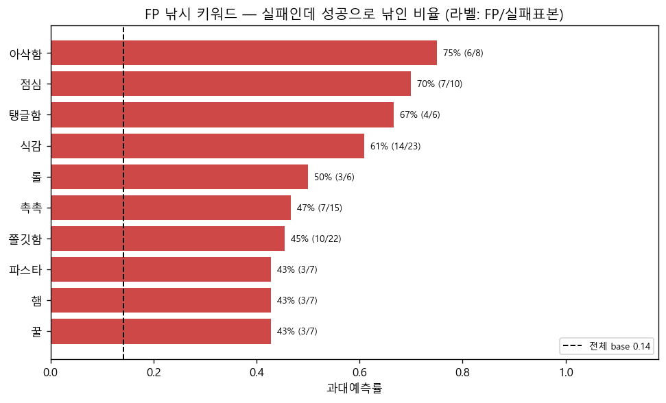
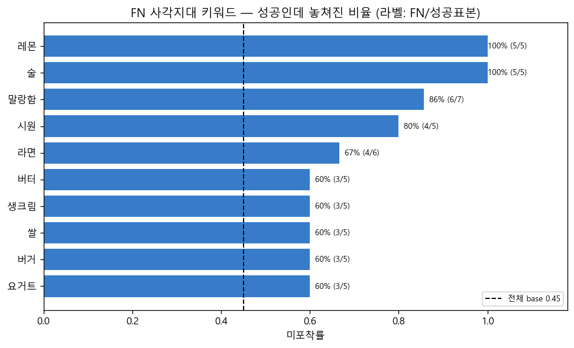
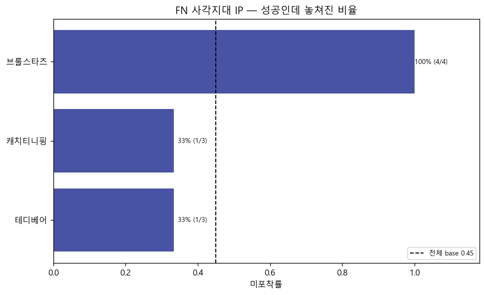

# 오분류 다발 키워드·IP 분석 — 무엇이 모델을 헷갈리게 하나

> v2_sweepA · test 754개 · **배포 운영점 THR=0.7049** · 분면 TP99/FP81/FN81/TN493 · `misclassification_keywords.ipynb` Run All 자동 생성.

## 0. 소목적 · 지표

FP(낚인 실패)·FN(놓친 성공)에 유난히 얽힌 **키워드·IP**를 찾아, 모델의 오분류를 *구체적 콘텐츠*로 설명한다(상위목적과 연결).

※ 분석 임계값 = **실제 배포 운영점 THR=0.7049**(serve.py 계열). 분석용 val F1-max(0.56)보다 보수적이라 FP는 줄고 FN은 늘며 base율도 달라진다(과대예측률 base↓·미포착률 base↑).

- **과대예측률(FP)** = FP/(FP+TN) = 그 키워드를 가진 **실제 실패** 제품이 성공으로 낚인 비율 (전체 base **14%**).
- **미포착률(FN)** = FN/(FN+TP) = 그 키워드를 가진 **실제 성공** 제품이 실패로 놓쳐진 비율 (전체 base **45%**).
- 단순 빈도(간식·달콤 등 흔한 키워드)는 제외. 표본 필터 FP: 실패표본≥5·FP≥3 / FN: 성공표본≥5·FN≥2. lift = 율/base.

## 1. FP 낚시 키워드 — 실패인데 성공으로 낚이게 만드는 키워드

| 키워드 | 과대예측률 | FP | 실패표본 | lift | 성격태그 |
|---|---|---|---|---|---|
| 아삭함 | 75% | 6 | 8 | 5.31 | 📈트렌드 |
| 점심 | 70% | 7 | 10 | 4.96 | 🔥고성공  |
| 탱글함 | 67% | 4 | 6 | 4.72 | 🔥고성공  |
| 식감 | 61% | 14 | 23 | 4.31 | 🔥고성공 📈트렌드 |
| 롤 | 50% | 3 | 6 | 3.54 | 📈트렌드 |
| 촉촉 | 47% | 7 | 15 | 3.31 | 📈트렌드 |
| 쫄깃함 | 45% | 10 | 22 | 3.22 | 📈트렌드 |
| 파스타 | 43% | 3 | 7 | 3.04 | 📈트렌드 |
| 햄 | 43% | 3 | 7 | 3.04 | - |
| 꿀 | 43% | 3 | 7 | 3.04 | - |
| 새콤 | 41% | 11 | 27 | 2.89 | 📈트렌드 |
| 상큼 | 40% | 14 | 35 | 2.83 | 📈트렌드 |

**📌** 이 키워드들을 가진 실패 제품은 평균(base 14%)보다 훨씬 자주 성공으로 과대예측된다. 트렌드/유사 성공작 외형 키워드가 모델을 낚는다(M1·M2의 FP 트렌드 최고와 정합).

## 2. FN 사각지대 키워드 — 성공인데 놓치게 만드는 키워드

| 키워드 | 미포착률 | FN | 성공표본 | lift | 성격태그 |
|---|---|---|---|---|---|
| 레몬 | 100% | 5 | 5 | 2.22 | 📈트렌드 |
| 술 | 100% | 5 | 5 | 2.22 | 📈트렌드 |
| 말랑함 | 86% | 6 | 7 | 1.90 | - |
| 시원 | 80% | 4 | 5 | 1.78 | 📈트렌드 |
| 라면 | 67% | 4 | 6 | 1.48 | - |
| 버터 | 60% | 3 | 5 | 1.33 | 📈트렌드 |
| 생크림 | 60% | 3 | 5 | 1.33 | - |
| 쌀 | 60% | 3 | 5 | 1.33 | 📈트렌드 |
| 버거 | 60% | 3 | 5 | 1.33 | - |
| 요거트 | 60% | 3 | 5 | 1.33 | 📈트렌드 |
| 젤리 | 56% | 5 | 9 | 1.23 | 📈트렌드 |
| 진함 | 56% | 5 | 9 | 1.23 | 📈트렌드 |

**📌** 이 키워드들을 가진 성공 제품은 평균(base 45%)보다 자주 놓쳐진다. 유사 성공작이 없는 희귀·신규 성격 키워드가 사각지대(keyword_generality의 "고성공=희귀"와 정합).

## 3. IP

- FP 낚시 IP: 자격 표본 2개로 부족(IP는 제품당 0~소수라 희소) → 생략.

**FN 사각지대 IP**

| IP | 미포착률 | FN | 성공표본 | lift |
|---|---|---|---|---|
| 브롤스타즈 | 100% | 4 | 4 | 2.22 |
| 캐치티니핑 | 33% | 1 | 3 | 0.74 |
| 테디베어 | 33% | 1 | 3 | 0.74 |

## 종합 · 한계

- **FP**: 트렌드·유사 성공작 외형 키워드가 실패작을 성공으로 낚는다. **FN**: 희귀·신규(특이 성공 신호 없는) 키워드가 성공작을 사각지대로 만든다. → M1·M2·M3·keyword_generality와 같은 결론을 *실제 키워드 이름*으로 확인.

- **한계**: test 소표본(FP81·FN81)이라 키워드별 표본도 작음(상위도 표본 5~수십) → 방향·예시로만 해석. **상관이지 인과 아님**(이 키워드가 오분류를 *유발*한다는 증거 아님).
