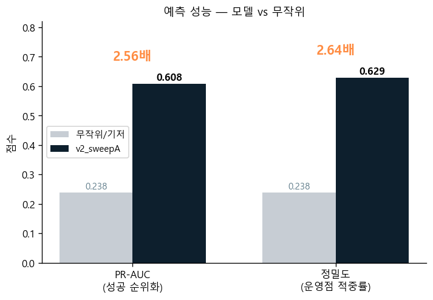
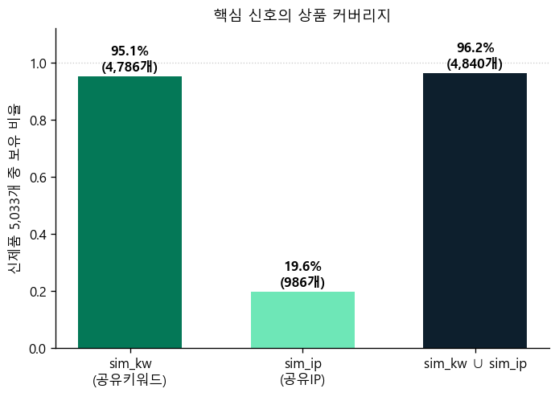
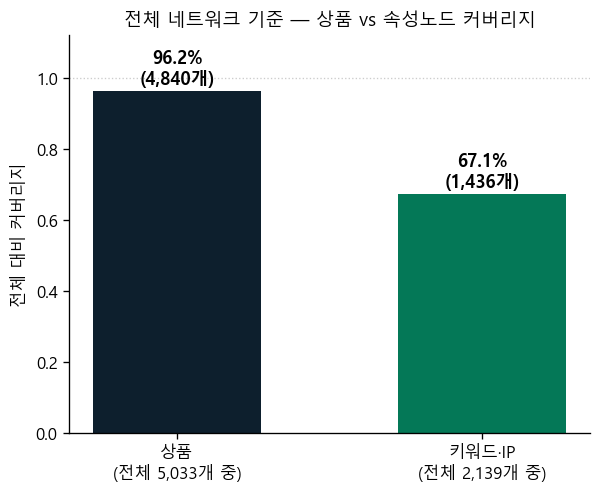
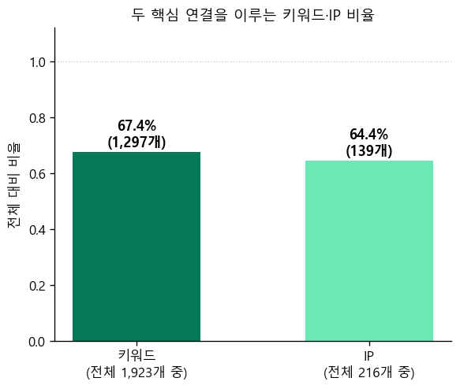
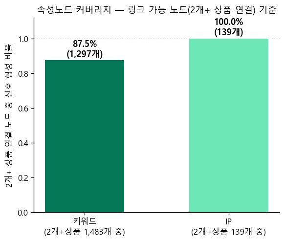
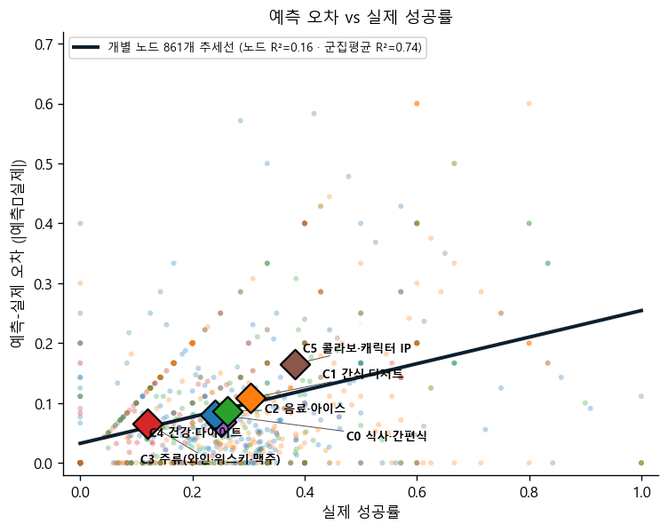
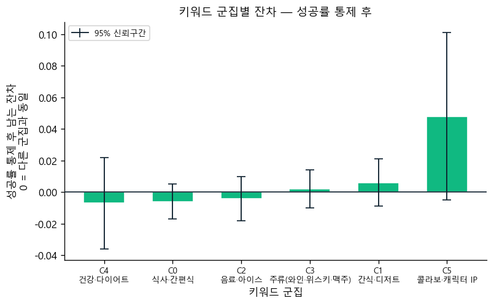

# 최종 모델 강점 보고서 — 신제품 성공 예측의 신뢰성과 키워드 군집 무관 Robustness
> 모델 `v2_sweepA` · 신제품 5,033개 · 운영 임계값 0.7049 · 분석(`keyword_cluster_eda_report.md`) 결과를 강점 관점으로 종합.

> 🎯 **이 보고서의 용도**: *이 모델을 신제품 선별에 믿고 써도 되나?* — 아래 강점 4가지로 검증한다.
## 한눈에 — 핵심 강점 4
| 강점 | 지표 | 수치 | 의미 |
|---|---|---|---|
| ① 실전 예측력 | test PR-AUC | **0.608** (무작위 0.238의 **2.56배**) | 뜰 신제품을 정확히 순위화 |
| ② 운영 정밀도 | 운영점 precision | **62.9%** (기저의 2.6배) | 「성공」 예측의 적중률 |
| ③ 신호 도달률 | sim_kw∪sim_ip 커버리지 | **96.2%** (5,033 중 4,840) | 지배 신호가 거의 모든 상품에 |
| ④ 키워드 군집 무관 robust | 키워드 군집이 오차에 더하는 설명력 | **ΔR²=0.009** (≈0) · 성공률 통제 후 전 군집 동일 정확도 | 카테고리 가리지 않고 균일 |

> **결론**: v2_sweepA는 신제품 성공을 무작위의 2.5배 이상으로 순위화하며, 그 신뢰도는 **특정 키워드 군집에 치우치지 않고 대부분의 키워드 군집에서 균일**하다 — 카테고리를 가리지 않고 신뢰할 수 있는 **robust한 모델**이다.
## 강점 1 — 실전 예측력 (무작위의 2.56배)
핵심은 *순위화*다: 5,033개 신제품 중 실제로 흥행할 것을 모델이 얼마나 앞으로 끌어오나.

| 분할   |   PR_AUC |   ROC_AUC |     F1 |   임계값 |
|:-------|---------:|----------:|-------:|---------:|
| train  |   0.7237 |    0.9076 | 0.6948 |   0.588  |
| val    |   0.588  |    0.8115 | 0.5741 |   0.5593 |
| test   |   0.6083 |    0.8314 | 0.6121 |   0.4535 |

**[그림 데이터] 헤드라인 막대 (모델 vs 무작위):**

| 지표 | v2_sweepA | 무작위·기저 | 배수 |
|---|---|---|---|
| PR-AUC (성공 순위화) | 0.608 | 0.238 | 2.56배 |
| 정밀도 (운영점 적중률) | 0.629 | 0.238 | 2.64배 |

*그림: 무작위(기저 성공률 0.238) 대비 모델의 성공 순위화·운영점 정밀도 리프트.*

**📌 "성공 순위화"·"2.56배"가 뭔가** — 모델은 신제품마다 *성공 확률*을 매겨 5,033개를 줄세운다(순위화). 잘 순위화하면 실제 성공작이 앞쪽에 몰린다. **PR-AUC**는 그 "성공작이 앞에 몰린 정도"를 0~1로 요약한 점수이고, *무작위로 줄세웠을 때의 PR-AUC = 성공 비율 그 자체(0.238)*다. 모델 0.608은 그 **2.56배** — 즉 모델 상위 후보를 따라가면 무작위보다 성공작을 그만큼 더 빽빽이 만난다. (정밀도와 다른 이유: PR-AUC는 *모든 임계값*에 걸친 순위 품질, 정밀도는 *한 운영점*에서의 적중률.)

- **PR-AUC 0.608 = 무작위의 2.56배** · ROC-AUC 0.831.
- 배포 운영점(THR 0.7049)에서 「성공」예측 1,143개 중 **719개 적중 → 정밀도 62.9%**(기저 23.8%의 2.6배). 적은 베팅으로 높은 적중.

| 운영점 혼동행렬(THR 0.7049) | 예측 실패 | 예측 성공 |
|---|---|---|
| 실제 실패 | 3,412 | 424 |
| 실제 성공 | 478 | 719 |

> **⚠ 지표 데이터 범위(정직)**: 위 **PR-AUC·ROC·F1은 test 홀드아웃**(표 test 행) 기준이다. 반면 **정밀도·혼동행렬·강점4 분석은 전체(train+val+test)** 기준 — 원천 예측 파일에 split 컬럼이 없어 test-only 혼동행렬을 재구성할 수 없기 때문. 전체 기준은 train 적합치를 포함해 *절대 수치*가 다소 낙관적일 수 있으나, 강점4의 *군집 간 균일성* 결론은 train 최적화가 전 군집에 공통이라 영향이 작다.
## 강점 2 — 설명가능한 메커니즘 (XAI)
모델은 블랙박스가 아니다. DiffMG 게이트가 **스스로** 어떤 관계가 성공을 가르는지 학습했고, 그 1·2위가 *유사상품(공유키워드·공유IP)* 이다.

| 관계(한글)              | 관계_원본                    |    α_r |   균등대비(배) |
|:------------------------|:-----------------------------|-------:|---------------:|
| 유사상품(공유키워드)    | product__sim_kw__product     | 0.6136 |          13.5  |
| 역-유사상품(공유IP)     | product__rev_sim_ip__product | 0.1049 |           2.31 |
| 유사상품(공유IP)        | product__sim_ip__product     | 0.1035 |           2.28 |
| 역-유사상품(공유키워드) | product__rev_sim_kw__product | 0.0486 |           1.07 |

*위 4개 외 나머지 18개 관계의 α는 가중치 초기값(≈0.0072) 수준 — 그림에서 막대가 거의 0인 이유.*

*그림: 24개 엣지 관계의 학습 가중치 α — 가중치 초기값을 크게 넘는 유사상품 관계만 신뢰 신호.*
- 메시지: "**같은 키워드·IP를 공유한 이웃 상품들이 얼마나 성공했나**"가 예측의 핵심 — 수작업 규칙 없이 모델이 발견한 기획 근거.
## 강점 3 — 핵심 신호가 거의 모든 상품에 도달
강점2의 신호가 *일부 상품에만* 있다면 robust할 수 없다. 실제 커버리지는?

**[그림 데이터] 신호별 상품 커버리지:**

| 신호 | 정의 | 커버리지(5,033 중) |
|---|---|---|
| sim_kw | 다른 상품과 키워드 ≥3 공유 | **95.1%** (4,786) |
| sim_ip | 다른 상품과 IP ≥1 공유 | 19.6% (986) |
| 둘 중 하나 | sim_kw ∪ sim_ip | **96.2%** (4,840) |

*그림: 신제품 5,033개 중 각 신호 엣지를 가진 상품 비율.*

- **지배 신호(sim_kw)가 상품의 95.1%에 존재**(이웃 중앙 91개로 풍부)하고, 두 신호를 합치면 **96.2%** 커버. 신호 없는 상품은 193개(3.8%, 키워드<3·IP없는 굿즈·위스키류)뿐 → 모델 신뢰도가 특정 카테고리에 갇히지 않는 **구조적 토대**.

### 강점 3 보강 — 신호를 만든 *속성 노드* 비율
그 유사 신호가 *어떤 키워드/IP로* 형성됐나. 분모를 두 가지로 본다.

**한눈에 — 전체 네트워크 기준, 상품 vs 속성노드:**

**[그림 데이터] 전체 기준 — 상품 vs 속성노드 커버리지:**

| 대상 | 커버리지 | 개수 |
|---|---|---|
| 상품 | **96.2%** | 4,840/5,033 |
| 키워드·IP 노드 | 67.1% | 1,436/2,139 |

- 신호가 닿는 **상품은 96.2%**, 그 신호를 만든 **키워드·IP 노드는 전체 대비 67.1%**(1,436/2,139). 노드 측이 낮아 보이는 건 단발(상품 1개) 노드 때문 — 아래 두 기준으로 분해한다.

**(기준 1) 전체 네트워크 대비** — 단발(상품 1개) 노드까지 포함한 보수적 기준:

**[그림 데이터] 전체 네트워크 대비 기여 노드:**

| 노드 | 기여 정의 | 전체 대비 |
|---|---|---|
| 키워드 | 키워드 ≥3 공유 상품쌍의 공유집합에 등장 | **67.4%** (1,297/1,923) |
| IP | IP ≥1 공유 상품쌍에 등장 | 64.4% (139/216) |

**(기준 2) 링크 가능 노드(2개+ 상품 연결) 대비** — *유사 링크를 만들 수 있는* 후보만(단발 제외):

**[그림 데이터] 2개+ 상품에 쓰인 노드 대비:**

| 노드 | 링크 가능 분모 | 링크 가능 대비 |
|---|---|---|
| 키워드 | 2개+ 상품 등장 1,483개 | **87.5%** (1,297/1,483) |
| IP | 2개+ 상품 등장 139개 | **100.0%** (139/139) |

- **단발(상품 1개) 키워드·IP는 정의상 유사 링크를 만들 수 없다**(공유할 짝이 없음). 이들을 뺀 *링크 가능 노드* 기준이면 키워드 **87%**·IP **100%**가 실제로 신호를 만든다 — 신호는 소수 키워드에 기댄 게 아니라 *연결될 자격이 있는 거의 모든 속성*이 만든 **두터운 신호**다. (IP는 2개+ 상품에 쓰이면 자동으로 공유되므로 100%.)
## 강점 4 — 키워드 군집 무관 균일 신뢰 (Robust의 핵심 증거)
"잘 맞는 카테고리만 골라 자랑"하는 게 아니라, **어느 키워드 군집에서도 정확도가 같음**을 두 단계로 입증한다: 오차의 *원인*(a) → 성공률을 맞추면 *모든 군집 동일 수준*(b).

> **키워드 군집은 어떻게 나눴나**: 강점2의 신호 구조 그대로 — *키워드 ≥3 공유* 상품들이 만든 키워드·IP 연결망(1,436노드)에 **Louvain 군집화**(modularity 최대)를 적용해 16개 중 노드 다수를 담은 **6개 의미군**으로 자동 분리(사람이 임의로 자른 게 아님): 식사·간편식 / 간식·디저트 / 음료·아이스 / 주류 / 건강·다이어트 / 콜라보·IP.

**관찰** — 군집마다 *실제 성공률·예측 성공률·오차(MAE)* 가 다르게 나타난다(기술 보고서 §5):

> **「오차」가 뭔가** (기술 보고서 §5 기준): 키워드(노드)마다 *실제 성공률*(그 키워드를 단 상품들이 실제 흥행한 비율)과 *모델 예측 성공률*(모델이 성공≥0.7049로 본 비율)을 잰다. 둘의 차 절댓값 **|예측 성공률 − 실제 성공률|** 이 그 키워드에 대한 모델의 **예측 오차**(클수록 부정확, 방향 무관)다. (a)·(b)는 *이 오차가 키워드 군집마다 다른지*를 본다. — 절댓값을 쓰는 이유: 부호를 살리면 과대·과소가 상쇄돼 부정확해도 평균 0인 군집이 정확해 보이기 때문.

|   군집 | 군집명                 |   MAE |   실제성공률 |   예측성공률 |
|-------:|:-----------------------|------:|-------------:|-------------:|
|      3 | 주류(와인·위스키·맥주) | 0.066 |        0.12  |        0.084 |
|      4 | 건강·다이어트          | 0.069 |        0.252 |        0.213 |
|      0 | 식사·간편식            | 0.081 |        0.24  |        0.254 |
|      2 | 음료·아이스            | 0.087 |        0.263 |        0.227 |
|      1 | 간식·디저트            | 0.108 |        0.303 |        0.247 |
|      5 | 콜라보·캐릭터 IP       | 0.165 |        0.383 |        0.392 |

- 키워드 군집별로 모델이 잘 포착하는 군집 패턴이 보이는 듯 싶다. 그러나 *MAE가 실제 성공률과 비례관계를 보이기에, **단순히 실제 성공률이 낮아서 MAE가 낮은 건지 모델의 실력인지 구분할 수 없다.** 따라서 군집별로 상이한 실제 성공률(base rate)을 통제하여 모델이 어떤 패턴을 특히 잘 잡아내는지 파악하기 위한 분석을 이어 진행했다.*

**(a) 오차가 큰 군집은 *주제(군집) 탓*이 아니라 *성공률이 높아서*다**

- MAE가 가장 작은 주류(와인·위스키·맥주) 0.066부터 가장 큰 콜라보·캐릭터 IP 0.165까지 벌어진다 — *어떤 군집은 왜 더 부정확한가?* 주제가 어려워서가 아니라 **성공률로 거의 다 설명된다**:

**왜 회귀인가 — base rate를 통제하는 절차**: 성공률을 *똑같이 맞춰도* 군집마다 오차가 다른지를 회귀로 가른다. ① 노드별 오차(|예측−실제|)를 *실제 성공률*에 직선 회귀해 「같은 성공률대 노드가 으레 갖는 오차」(= base rate 추세선)를 구하고, ② 그 회귀식에 *군집 라벨(이진변수)* 을 더 넣어 성공률을 통제하고도 군집이 오차를 **추가로** 설명하는지(ΔR² 증가)를 본다. ③ 군집을 넣어도 R²가 거의 안 오르면(ΔR²≈0) → 오차는 성공률만으로 설명되고 군집(주제)은 무관 = MAE 차이는 성공률 차이의 반영. (아래 그림·계수표가 그 결과다.)

**[그림 데이터] 추세선·설명력** — 보정오차 = 0.033 + 0.222·실제성공률 · 노드 R²=0.16 · 군집평균 R²=0.74. 산점도 ◆ 6점 = 위 군집별 (실제성공률, MAE) 표.

*그림: 옅은 점=개별 노드(키워드/IP) 861개, ◆=6개 군집 평균. 검은 추세선은 *개별 노드*에서 추정 — 노드는 흩어져도(노드 R²=0.16) 군집 평균(◆)은 추세선에 밀착(군집 R²=0.74).*
- **추세선은 개별 노드 861개에서 나왔다**(검은 선). 노드는 노이즈가 커 *노드 단위 R²=0.16*에 그치지만, **군집 평균(◆)으로 모으면 노이즈가 상쇄돼 R²=0.74**로 또렷 — 둘은 *같은 추세(기울기 +0.22)를 다른 배율*로 본 것이지 별개 분석이 아니다(그래서 개별 점과 군집 ◆를 한 그림에 겹쳤다). 성공률이 높을수록 0.5에 가까워 오차 여지가 커지는 통계적 성질.

> ⚠ **R²=0.74를 오해 말 것**: 이는 *군집 평균 6점끼리*의 설명력(군집 간 오차 차이의 74%)일 뿐이다 — **「성공률이 (개별) 오차의 74%를 설명한다」/「추세선이 모델의 74%를 설명한다」고 말하면 안 된다**(개별 노드 수준 설명력은 R²=0.16, 즉 16%뿐). 집계하면 R²가 부풀려지므로(생태학적 오류·6점은 표본 부족), **결론은 개별 노드 861개 회귀로만 내고 군집 6점은 추세 가시화용 예시다(6점으로는 결론을 내지 않는다).**
- **그럼 *군집(주제)* 자체가 오차에 기여하나? — 개별 노드 861개로 직접 검정**(노드 단위, 6점 아님): 절댓값오차 ~ 성공률 + *군집 이진더미 5개*(한 군집 기준=`식사·간편식`, 절편 공선성 회피). 성공률만으로 **노드 오차의 R²=0.16**를 설명하는데, 거기에 군집더미를 더해도 R²=0.17 — **ΔR²=0.009(0.9%p)** 증가에 그친다(군집은 노드 오차에 거의 기여 안 함).

*회귀 계수표 (각 변수 p-value 포함):*
| 변수                            |   계수 |   표준오차 |     t |   p_value |
|:--------------------------------|-------:|-----------:|------:|----------:|
| 절편                            |  0.028 |      0.007 |  3.91 |     0     |
| 성공률(F1)                      |  0.214 |      0.018 | 11.81 |     0     |
| 군집더미:간식·디저트            |  0.013 |      0.009 |  1.45 |     0.146 |
| 군집더미:음료·아이스            |  0.002 |      0.01  |  0.24 |     0.811 |
| 군집더미:주류(와인·위스키·맥주) |  0.008 |      0.011 |  0.67 |     0.5   |
| 군집더미:건강·다이어트          | -0.001 |      0.017 | -0.05 |     0.957 |
| 군집더미:콜라보·캐릭터 IP       |  0.056 |      0.019 |  2.88 |     0.004 |
- **핵심은 효과크기**: 키워드 군집 라벨을 다 넣어도 설명력이 **ΔR²=0.009(0.9%p)** 즉 *거의 0*이다 — 오차는 키워드 군집이 아니라 성공률(F1, p<0.001)이 좌우한다. *(계수표의 콜라보·IP 더미가 개별 p<0.05지만, 이는 노드 861개의 **대표본 효과**일 뿐 추가 설명력은 ΔR² 0.9%p로 무시 가능 — 결합 F검정도 p=0.09로 비유의.)* → **어느 키워드 군집도 오차 크기를 의미있게 키우지 않는다 = 맹점(blind spot) 없음.**

**(b) 그래서 성공률을 맞추면 *모든 키워드 군집이 동일한 신뢰 수준* — 맹점 없음**

**[그림 데이터] 군집별 잔차 ± 95%CI (막대 소스):**

|   군집 | 군집명                 |   노드수 |   평균보정오차 |   기대오차 |   잔차 |   CI95 |
|-------:|:-----------------------|---------:|---------------:|-----------:|-------:|-------:|
|      4 | 건강·다이어트          |       37 |          0.069 |      0.076 | -0.007 |  0.029 |
|      0 | 식사·간편식            |      305 |          0.081 |      0.088 | -0.006 |  0.011 |
|      2 | 음료·아이스            |      157 |          0.087 |      0.091 | -0.004 |  0.014 |
|      3 | 주류(와인·위스키·맥주) |      104 |          0.066 |      0.064 |  0.002 |  0.012 |
|      1 | 간식·디저트            |      229 |          0.108 |      0.102 |  0.006 |  0.015 |
|      5 | 콜라보·캐릭터 IP       |       29 |          0.165 |      0.117 |  0.048 |  0.053 |

*그림: 성공률 효과를 뺀 뒤 남는 군집별 오차(잔차)와 95% 신뢰구간. 모든 막대가 0 근처이고 신뢰구간이 0을 포함 → 어느 군집도 더 부정확하지 않다.*
- (a)에서 오차가 성공률로 결정됨을 봤으니, **성공률 수준을 동일하게 맞추면 6개 키워드 군집이 모두 0 근처에 모인다**(잔차 신뢰구간 전부 0 포함). 즉 **주류든 콜라보든 어느 키워드 군집이라도 모델을 같은 수준으로 신뢰**할 수 있고, 구조적으로 헛짚는 맹점 키워드 군집이 없다.
- *신뢰구간(검은 막대) 읽는 법*: 막대는 **평균잔차 ± 1.96×(표준편차/√노드수)** — 그 군집 *평균 잔차*의 불확실 범위다(개별 노드가 들어가는 범위가 아님; 노드수 적은 콜라보가 막대가 긴 이유). **95% 신뢰 수준에서 그 군집의 참 평균 잔차가 이 범위 안에 있다고 본다.** 그래서 막대가 0을 걸치면 "그 군집이 평균과 다르다고 할 통계적 근거가 없다"는 뜻이다.

> **종합**: 신호가 거의 모든 상품에 도달(③)하고, 그 위에서 *오차 크기가 성공률로만 설명되고(a, ΔR²≈0)·성공률을 맞추면 모든 군집이 동일 정확도(b)* — 즉 **대부분의 키워드 군집에서 균일하게 신뢰**할 수 있다.
## Robustness 논증 — 한 장 요약
| 단계 | 주장 | 증거(수치) | 출처 |
|---|---|---|---|
| 1 | 신뢰할 예측력이 있다 | test PR-AUC 0.608 = 무작위 2.56배 | 강점1 |
| 2 | 그 신호는 키워드 군집 불문이다 | sim_kw α 0.61(13.5배), 전 상품 적용 | 강점2 |
| 3 | 신호가 거의 모든 상품에 도달 | 커버리지 96.2% | 강점3 |
| 4 | 오차 크기가 키워드 군집 아닌 성공률로 결정 | 군집더미 ΔR²=0.009(거의 0) | 강점4(a) |
| 5 | 모든 키워드 군집 동일 정확도(맹점 없음) | 잔차 전 군집 0 근처(CI 0 포함) | 강점4(b) |
| → | **대부분의 키워드 군집에서 robust** | 카테고리 무관 균일 신뢰 | 종합 |
## 실무 적용 · 정직한 경계
- **적용**: 모델 성공확률을 *카테고리에 상관없이 동일하게* 신뢰해 신제품 후보를 순위화·선별할 수 있다 — 특정 키워드 군집만 믿고 다른 군집을 의심할 근거가 없다.
- **경계**: 본 robust는 *무편향·무맹점(균일 신뢰)* 을 뜻하며, "특정 키워드 군집의 위너를 *더* 잘 골라낸다"는 군집별 판별력 우열 주장은 아니다(군집별 PR-AUC 후속 과제). 운영점(0.7049)은 정밀도 우선이라 전반적으로 약간 보수적이다(예측을 실제보다 다소 적게 「성공」으로 분류).
- **데이터 범위**: 정밀도·보정·잔차 분석은 전체(train 포함) 기준이라 절대 수치는 다소 낙관적일 수 있다(test-only는 split 부재로 재구성 불가). PR-AUC·ROC·F1은 test 기준.
