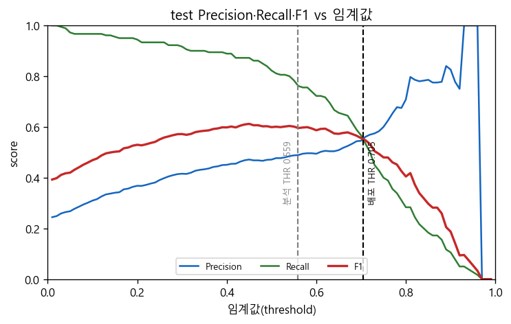
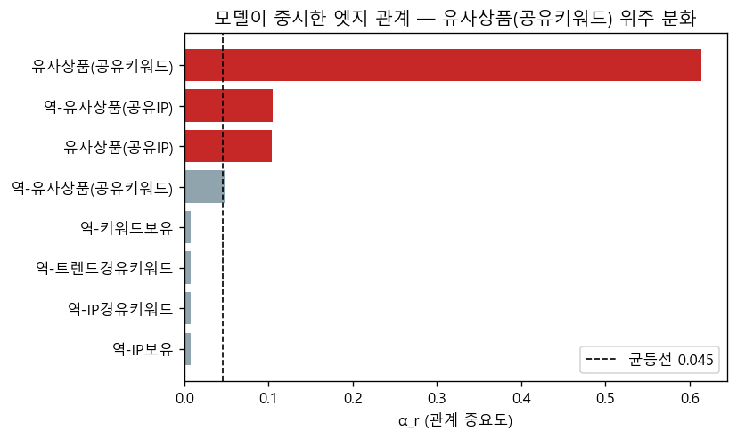
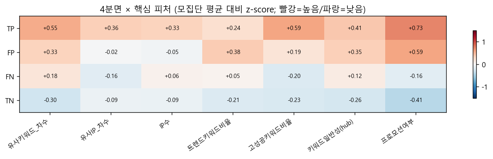
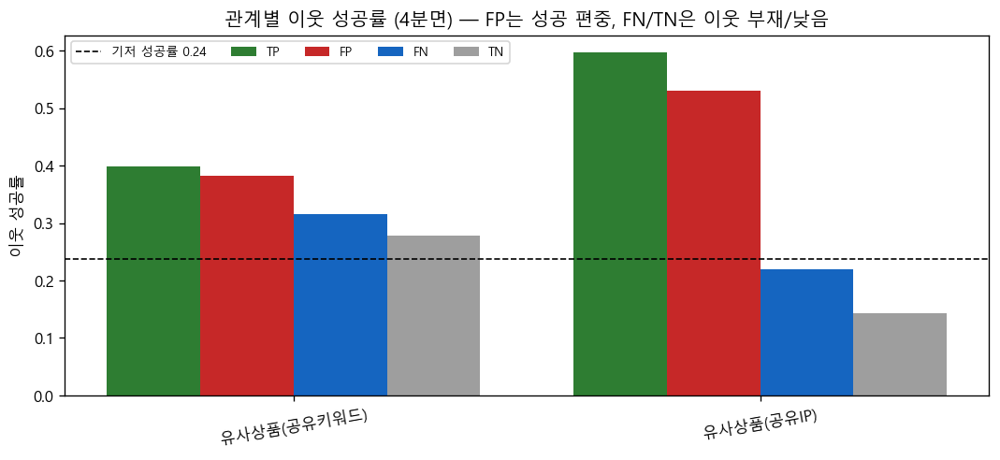
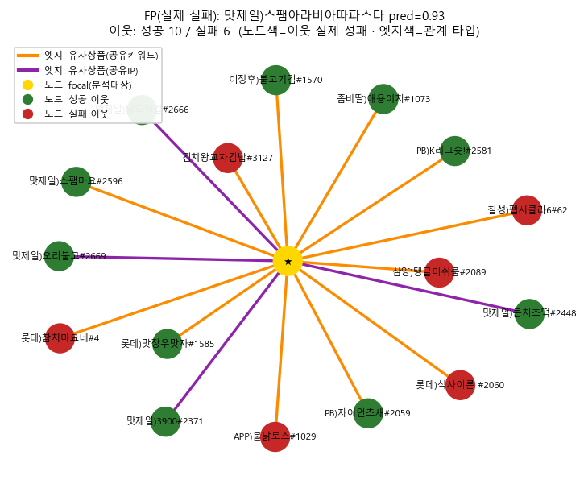
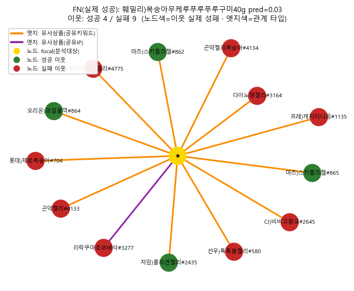

# v2_sweepA 오분류(FP/FN) 구조 진단 — 분석 보고서

> 모델 `v2_sweepA` · test 754개 · 운영 임계값 THR=0.5593(val F1-max) · 노트북 Run All 시 자동 생성.

## 0. 분석 개요 — 왜 / 무엇을 / 어떻게

**배경**: v2_sweepA은 신제품 성공을 test PR-AUC **0.608**(랜덤 0.239의 **2.55배**)로 잘 순위화하나, 임계값(THR=0.559)으로 잘랐을 때 **어떤 제품에서 왜 틀리는지**는 알 수 없다.

**⚠ leak-free 모델**: v2_sweepA는 이전 exp41이 가장 의존하던 동반구매(co_offline, α 0.13)가 **출시-후 매출 누수**라 입력에서 제거하고, 그 가치를 키워드 보완재(basket_comp)·보조 예측 타깃으로 재배치한 모델이다. PR-AUC 0.696→0.608 하락은 *실력 저하가 아니라 증발한 누수*이며, 본 진단은 leak-free 모델의 정직한 오분류를 본다.

**분석 질문**: 모델이 실제 성공을 놓치고(FN) 실제 실패에 낚이는(FP) **구조적 원인**을 노드·엣지·이웃 패턴에서 찾는다. test 754개를 TP/FP/FN/TN 4분면으로 분해(TP·TN을 정상 기준선으로 대조).

**모델 신호 구성(v2_sweepA)**: 본 모델은 영수증 동반구매(co_offline/co_quick)를 **사용하지 않는다**. DiffMG 게이트가 분화시킨 신호는 **유사상품(공유키워드 sim_kw·공유IP sim_ip)** 위주이며, 모두 **채널 독립**(세븐·CU·GS25 공통)이다. 따라서 본 보고서는 채널 전용 전제 없이, *유사상품 이웃의 성패 구성*을 중심으로 오분류를 해석한다.

**한눈 결론 (2대, 시각자료 수치 근거)**

1. 🔴 **FN(놓친 성공)** — **유사상품(IP) 이웃 성공률이 낮다**(FN 0.22 vs TP 0.60). 과거 성공작과 닮지 않은 *신규·이질* 성공이라 모델이 끌어올리지 못함.
2. 🟠 **FP(낚인 실패)** — 유사상품(IP) 이웃이 **성공 편중**(FP 0.53 ≈ TP 0.60) + 트렌드 키워드 비율 4분면 최고(0.63) → 성공작과 닮은 외형·트렌드로 과대평가.
### 분석 흐름 요약

| 단계 | 분석 목표 | 핵심 자료 | 결론 |
|---|---|---|---|
| M0 | 모델 유효성·중시 신호 | α_r 막대 | 유사키워드(sim_kw) 위주 분화 |
| M1·M2 | FP/FN 자기특성 | 4분면 z-score 히트맵 | 예측성공일수록 유사IP·프로모션·트렌드↑ |
| M3 ★ | 이웃 라벨 구성(인과) | 이웃성공률 그룹막대 | 유사IP 이웃 성공률이 예측성공/실패를 가름 |
| M5 | 대표 사례 | ego-network | 정량 패턴의 사례 예시(일반화 아님) |
## M0. 성능 · 모델이 중시한 엣지 관계(α_r)

### 🎯 분석 목표
모델이 실전에서 쓸 만한 성능인지와, 성패 예측을 *어떤 엣지 관계에 기대어* 내리는지 파악한다(이후 오분류 원인을 어느 관계에서 찾을지 결정).

### 🔬 분석 방법
split별 성능과 DiffMG α_r(24개 관계, 균등선 1/24=0.045)을 추출, 균등선 대비 배율로 분화된 관계를 식별.

| 분할 | PR_AUC | ROC_AUC | F1 | 임계값 |
|---|---|---|---|---|
| train | 0.7237 | 0.9076 | 0.6948 | 0.588 |
| val | 0.588 | 0.8115 | 0.5741 | 0.5593 |
| test | 0.6083 | 0.8314 | 0.6121 | 0.4535 |

**test 혼동행렬 ① 분석용 THR=0.5593 (val F1-max)**

| index | 예측 실패 | 예측 성공 |
|---|---|---|
| 실제 실패 | 431 | 143 |
| 실제 성공 | 43 | 137 |

**② 배포 운영점 THR=0.7049** (serve.py 실서빙 임계값 계열; FP↓·FN↑)

| index | 예측 실패 | 예측 성공 |
|---|---|---|
| 실제 실패 | 493 | 81 |
| 실제 성공 | 81 | 99 |

**그림: test Precision·Recall·F1 vs 임계값** (회색 점선=분석 THR, 검정 점선=배포 THR)

| 관계(한글) | 관계_원본 | α_r | 균등대비(배) |
|---|---|---|---|
| 유사상품(공유키워드) | product__sim_kw__product | 0.6136 | 13.5 |
| 역-유사상품(공유IP) | product__rev_sim_ip__product | 0.1049 | 2.31 |
| 유사상품(공유IP) | product__sim_ip__product | 0.1035 | 2.28 |
| 역-유사상품(공유키워드) | product__rev_sim_kw__product | 0.0486 | 1.07 |
| 역-키워드보유 | keyword__rev_has_kw__product | 0.0073 | 0.16 |
| 역-트렌드경유키워드 | keyword__rev_has_kw_trend__product | 0.0072 | 0.16 |
| 역-IP경유키워드 | keyword__rev_has_kw_via_ip__product | 0.0072 | 0.16 |
| 역-IP보유 | ip__rev_has_ip__product | 0.0072 | 0.16 |

### 📊 핵심 시각자료

**📌 이 그림에서 볼 점** — 막대가 **균등선(검정 점선)을 크게 넘는 관계만** 신뢰 신호다. 최상위가 유사상품(공유키워드 sim_kw)이고 그 다음 유사상품(공유IP); 키워드·IP·트렌드·보완재 관계는 균등선 부근.

### ✅ 결론
유사상품(공유키워드 sim_kw 13.5배)·유사상품(공유IP 2.28배)만 분화 → 성패는 *유사 기존 상품(키워드·IP 공유)*이 좌우. ⇒ 오분류 원인도 이 관계의 이웃에서 찾는다(M3). 모든 신호가 **채널 독립**이라 채널 전용 전제 없이 비교 가능.

## M1·M2. 노드 피처 · 관계 참여 4분면 대조

### 🎯 분석 목표
FP/FN이 자기 콘텐츠·연결 구조에서 정상군(TP/TN)과 어떻게 다른지 한 장으로 본다.

### 🔬 분석 방법
제품별 13개 피처를 4분면 평균한 뒤 핵심 7개를 히트맵으로: **색 = 전체 모집단(754) 평균 대비 z-score**(스케일 다른 피처 비교용), **셀 숫자도 같은 z-score 값**(소수점 2자리). 유의성은 노트북 Mann–Whitney.

### 용어 — 파생 지표 정의 (차수 · 고성공/고실패 키워드 · 키워드 일반성)

'차수'는 제품 노드에서 해당 관계로 **1홉 연결된 이웃 수**(나가는 엣지 수).

| 컬럼 | 엣지(관계) | 의미 |
|---|---|---|
| 유사키워드_차수 | product–product (sim_kw) | 공유 키워드 ≥3인 **유사 제품** 수 |
| 유사IP_차수 | product–product (sim_ip) | 공유 IP ≥1인 **유사 제품** 수 (※ IP 노드 degree 아님) |
| IP연결_차수 | product→ip (has_ip) | 제품에 직접 연결된 **IP 노드** 수 |

**고성공/고실패 키워드 — 키워드(노드) 단위 라벨** (train+val 라벨만 → test 누수 차단). ⚠ 키워드와 상품은 서로 다른 노드이며, 이 라벨은 *키워드 노드*에 붙인다.
1. 키워드 k마다 **성공률(k) = (train+val에서 k를 보유한 상품 중 성공 상품 수) ÷ (k를 보유한 상품 수)**. 성공 상품 *수*가 아니라 **비율**임에 주의(흔한 키워드가 유리해지지 않도록).
2. 표본 적은 키워드 제외: train+val 등장 상품 수 ≥ 5.
3. 성공률 **상위 10%(≥0.45) = 고성공 키워드(72개)**, **하위 10%(≤0.00) = 고실패 키워드(99개)**.
→ 이를 다시 *상품(노드)* 피처로 환산: `고성공키워드비율(상품) = 그 상품이 보유한 키워드 중 고성공 키워드의 비율` (M1·M2 히트맵 컬럼은 이 상품 단위 값).
- 고성공 키워드 예시(키워드별 성공률): 관람(1.00), 로코모코(1.00), 알포트(0.83), 고창(0.80), 레드벨벳(0.80), 맥스봉(0.80), 하와이(0.80), 띠부씰(0.73)
- 고실패 키워드 예시(키워드별 등장 상품수): 캔(31회), 다리(22회), 찌개(21회), 소다(16회), 블렌디드(16회), 하림(15회), 빅(14회), 곰(14회)

**키워드 일반성(hub) — 상품(노드) 단위 피처**. 먼저 키워드 노드마다 `등장상품수(k) = train+val에서 k를 보유한 상품 수`를 센다(흔한 일반어↑/고유어↓).
그 다음 상품 s의 일반성 = **mean( 등장상품수(k) for k in (s의 키워드들) )** — s가 가진 키워드들이 평균적으로 몇 개의 상품에 등장하는가(degree centrality 대리값).
- 흔한 키워드 예시(키워드별 등장 상품수): 간식(2082), 달콤(1080), 야식(687), 디저트(593), 부드러움(582), 고소(469), 식사(464), 초코(462)

> 컷오프(≥5회·상·하위 10%)는 휴리스틱으로 조정 가능. 두 키워드 지표는 보조이며 결론은 채널 독립 신호 중심.

### 📊 핵심 시각자료

**📌 이 그림에서 볼 점** — **색 = 전형적 상품(모집단 평균) 대비** 높으면 빨강·낮으면 파랑, **숫자 = z-score 값**. 예측성공(TP·FP)일수록 유사키워드·유사IP 차수·프로모션·트렌드·고성공키워드가 붉다(모두 채널 독립 피처). 예측실패(FN·TN)는 이들이 낮다.

### ✅ 결론
채널 독립 신호 기준: 예측성공일수록 유사IP_차수(TP 9.8 vs FN 2.1)·프로모션·고성공키워드↑, 그리고 **FP는 트렌드키워드비율이 4분면 최고(0.63)**. FN은 이들 신호가 약해 밀려나고, FP는 트렌드 외형으로 성공처럼 보인다.

## M3 ★. 고-α 관계 이웃의 라벨 구성 (인과 핵심, 유사상품 중심)

### 🎯 분석 목표
점수를 지배하는 관계의 이웃이 성공/실패 어느 쪽인지가 GNN 메시지패싱으로 제품 점수를 끌어올리거나 내린다. **채널 독립 관계인 유사상품(sim_ip/sim_kw)**을 중심으로 FP/FN 원인을 검증한다(이웃 라벨 train+val만, 누수 0).

### 🔬 분석 방법
관계별(유사키워드 sim_kw·유사IP sim_ip) 이웃 성공률·보유율을 4분면 평균(기저 성공률 0.24). 두 관계 모두 **전 채널 공통**이라 채널 전제 없이 비교한다. (v2는 동반구매 미사용)

| 사분면 | 유사상품(공유키워드)_이웃성공률 | 유사상품(공유IP)_이웃성공률 |
|---|---|---|
| TP | 0.399 | 0.597 |
| FP | 0.382 | 0.531 |
| FN | 0.315 | 0.219 |
| TN | 0.278 | 0.142 |

| 사분면 | 유사상품(공유키워드)_이웃보유율 | 유사상품(공유IP)_이웃보유율 |
|---|---|---|
| TP | 1.0 | 0.358 |
| FP | 0.986 | 0.189 |
| FN | 0.977 | 0.186 |
| TN | 0.935 | 0.16 |

**유사상품(공유IP) 이웃 성공 구성 — 분면별 절대 개수·비율 (ego=test 분면 · 이웃 라벨=전체 train+val+test · 양방향 incidence)**

| 분면 | sim_ip 이웃 연결수 | 성공 이웃 수 | 성공 이웃 비율 |
|---|---|---|---|
| TP | 2678 | 1560 | 0.583 |
| FP | 1216 | 638 | 0.525 |
| FN | 178 | 46 | 0.258 |
| TN | 2696 | 786 | 0.292 |
| 전체(test) | 6768 | 3030 | 0.448 |

> 분면별 **절대 개수**로 본 같은 패턴: 예측성공 TP 58%·FP 52% vs 예측실패 FN 26%·TN 29% (이웃 라벨=전체 데이터, 양방향 incidence). 위 평균-성공률 표와 동일 결론을 개수로 확인.

### 📊 핵심 시각자료

**📌 이 그림에서 볼 점** — **유사상품(공유IP) 막대를 보라**: 예측성공(TP 0.60·FP 0.53)이 예측실패(FN 0.22·TN 0.14)보다 뚜렷이 높다 — 분면을 가르는 핵심. 유사키워드(sim_kw)는 거의 전 제품이 보유(보유율~1.0)해 성공률 차이가 작은 약한 신호.

### ✅ 결론
**유사상품(IP) 이웃 성공률이 예측을 가른다**: 모델은 "성공한 유사 제품과 IP를 공유"하면 점수를 올린다. ⇒ **FP**(실제 실패)는 sim_ip 이웃 성공률 0.53로 TP(0.60)에 근접해 *성공작과 닮은 외형/IP*에 끌려 과대, **FN**(실제 성공)은 0.22로 낮아 *닮은 성공작이 없는 신규 성공*이라 못 올림. 유사키워드(sim_kw)는 거의 전 제품이 보유해 약한 신호. ※ FN의 낮은 sim_ip엔 타사 저성공 생태계 영향이 일부 섞일 수 있음(상관≠인과).

## M5. 극단 사례 정성 · Ego-Network

### 🎯 분석 목표
M3의 정량 결론(유사상품(공유키워드·공유IP) 이웃의 성공/실패 구성)이 개별 제품에서 어떻게 나타나는지 대표 사례로 확인.

### 🔬 분석 방법
대표 FP/FN의 **이웃 제품(유사상품: 공유키워드·공유IP)을 실제 성공(초록)/실패(빨강)로 색칠하고 엣지(연결선)는 관계 타입(유사IP·유사KW)별 색으로 구분한 ego-network**. 중심(노랑)이 focal 제품.

### 📊 핵심 시각자료

**📌 이 그림에서 볼 점** — 주변 노드 색이 그 이웃의 *실제 성패*다. **FP**는 성공(초록) 이웃에 둘러싸여 점수가 끌어올려졌고, **FN**은 이웃이 없거나 실패(빨강) 이웃이라 끌어올려지지 못했다(제목에 이웃 성공/실패 수 표기). 엣지(연결선) 색은 그 이웃이 focal과 어떤 관계(유사키워드·유사IP)로 이어졌는지를 나타낸다 — 범례 참조.

### ✅ 결론
M3 메커니즘(유사 성공 이웃이 점수를 좌우)이 개별 제품에서 그대로 보인다: FP=성공 이웃 후광, FN=성공 이웃 부재. ※ 사례 예시이며 일반화는 아님.

> **인터랙티브 버전**(공유 키워드/IP 노드까지 펼침): [FP ego](report_assets/m5_ego_fp.html) · [FN ego](report_assets/m5_ego_fn.html) — 검정 선=공유 키워드(◆)/IP(■) 경유 연결, 주황=유사키워드, 보라=유사IP.

## 종합 — 실패모드 · 처방 · 한계

> **leak-free 관점**: 아래 실패모드는 *누수를 제거한* v2 기준이다. exp41이 co_offline로 메우던 "확정 성공" 신호가 사라져 FP(143)·FN(43) 구성이 달라졌고, 이는 동반구매 없이 키워드·IP 유사도만으로 가른 정직한 한계다. 운영 임계값(≈0.70)에서는 FP가 크게 줄어든다(위 혼동행렬 ② 참조).

### 실패모드 (채널 독립 신호 기준)

- **FN(놓친 성공, 43개)**: 유사상품(IP) 이웃 성공률이 낮음(FN 0.22 vs TP 0.60) → 과거 성공작과 닮지 않은 신규 성공을 못 끌어올림.
- **FP(낚인 실패, 143개)**: 유사상품(IP) 이웃이 성공 편중(FP 0.53)·트렌드 키워드 다수(0.63) → 성공작과 닮은 외형/트렌드로 과대.
### 처방

1. **FN(신규 성공) 구제** — 유사 성공작이 없는 제품은 모델 점수가 구조적으로 낮으므로, 트렌드 신호 등 보조 룰로 후보 승격(단 트렌드는 FP도 유발 → 신중).
2. **FP 후광 보정** — 유사상품(IP) 이웃 성공률에 과의존하지 않도록 sim_ip 가중 조정/정규화.
### 한계

- test 소표본(FP·FN 수십 개) → 효과크기·방향 중심 해석.
- α_r·이웃 성공률은 **상관**(예측 기여)이지 인과 확정 아님.
